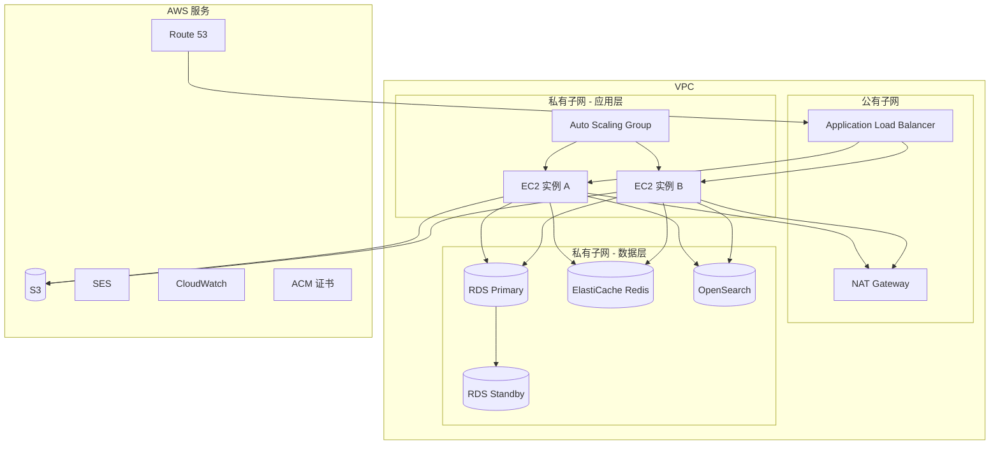
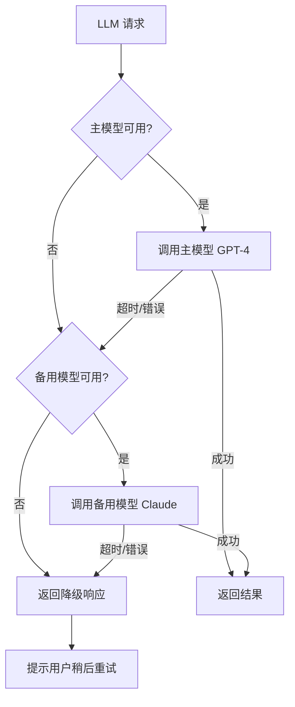

# 中泰智能法律专家系统 - 设计文档

## 概述

中泰智能法律专家系统是一个面向中国与泰国法律事务的商业化 SaaS 平台，部署于 Amazon EC2 服务器。系统通过集成外部大语言模型 API（OpenAI GPT-4、Anthropic Claude 等）实现智能法律分析，涵盖管辖权识别、IRAC 分析、合同起草/审查、案件分析、诉讼策略、证据组织、案例检索、签证咨询等核心法律服务。系统进一步融合 AI 智能对话引擎、AI 律师助理、多智能体 AI 律师团模拟、RAG 检索增强生成知识系统、智能风险评估、增强合同分析、法律文书自动生成、智能问答、AI 个性化适配和服务质量监控等深度 AI 能力，所有 AI 功能均通过外部模型 API 调用 + Prompt 工程 + RAG 架构实现，不涉及自建模型或模型微调。同时提供完整的用户认证、会员订阅、支付集成、多语言界面和 SEO 营销功能。

### 设计目标

- 构建可商业化运营的法律 SaaS 平台
- 支持中泰双法域法律分析能力
- 提供安全、合规的数据处理架构（GDPR/PDPA）
- 支持高并发访问和水平扩展
- 实现完整的付费会员和支付闭环
- 通过外部 LLM API + RAG 架构实现深度 AI 法律分析能力
- 多智能体律师团模拟提供全面策略分析
- 质量监控与幻觉检测保障 AI 服务可靠性

### 核心 AI 架构决策

| 决策项 | 选型 | 理由 |
|--------|------|------|
| AI 模型 | 外部 API（OpenAI GPT-4 / Anthropic Claude） | 无需自建模型，通过 Prompt 工程实现所有 AI 能力 |
| 向量数据库 | pgvector（PostgreSQL 扩展） | 与现有 PostgreSQL 基础设施统一，EC2 部署简单 |
| 文档嵌入 | OpenAI Embeddings API | 高质量向量表示，API 调用即用 |
| OCR 服务 | AWS Textract | 与 EC2 同属 AWS 生态，集成便捷 |
| 语音识别 | Web Speech API（浏览器原生） | 零服务器成本，客户端处理 |
| 多智能体 | 顺序 LLM 调用 + 角色专属 System Prompt | 同一 API 不同 Prompt 实现角色差异化 |
| PDF 生成 | Puppeteer | 支持复杂法律文书排版 |
| Word 生成 | docx 库 | 轻量级 .docx 文件生成 |

## 架构

### 高层系统架构

```mermaid
graph TB
    subgraph "客户端层"
        WEB[Web 浏览器]
        MOBILE[移动端浏览器]
    end

    subgraph "负载均衡层"
        ALB[Application Load Balancer]
        CF[CloudFront CDN]
    end

    subgraph "应用层 - EC2 Auto Scaling Group"
        subgraph "EC2 实例"
            NGINX[Nginx 反向代理]
            NEXT[Next.js 应用服务器]
            API[API 路由层]
        end
    end

    subgraph "服务层"
        AUTH[认证服务]
        LEGAL[法律分析服务]
        CONTRACT[合同服务]
        CASE[案件分析服务]
        VISA[签证咨询服务]
        PAYMENT[支付服务]
        SUB[订阅管理服务]
        SESSION[会话管理服务]
        REPORT[报告生成服务]
        SEO[SEO/营销服务]
        SECURITY[安全服务]
        DOCGEN[文书生成服务]
        QUALITY[质量监控服务]
    end

    subgraph "AI/LLM 层"
        LLM[LLM API Gateway]
        PROMPT[Prompt 模板引擎]
        JURIS[管辖权识别模块]
        IRAC[IRAC 分析引擎]
        EVIDENCE[证据评估模块]
        SEARCH[案例检索模块]
        CONVO[AI 对话引擎]
        INTENT[意图分类器]
        PARALEGAL[AI 律师助理]
        LAWYERTEAM[AI 律师团]
        RISK[风险评估器]
        HALLU[幻觉检测器]
    end

    subgraph "RAG/知识层"
        RAG[RAG 检索管线]
        EMBED[嵌入服务 - OpenAI Embeddings API]
        PGVEC[(pgvector 向量存储)]
        KB[法律知识库]
    end

    subgraph "数据层"
        PG[(PostgreSQL RDS + pgvector)]
        REDIS[(Redis ElastiCache)]
        S3[(S3 文件存储)]
        ES[(OpenSearch 全文检索)]
    end

    subgraph "外部服务"
        WECHAT_PAY[微信支付]
        ALIPAY[支付宝]
        STRIPE[Stripe]
        PROMPTPAY[PromptPay]
        WECHAT_LOGIN[微信登录]
        LINE_LOGIN[Line 登录]
        SES[Amazon SES 邮件]
        SMS[短信服务]
        OPENAI[OpenAI API]
        CLAUDE[Anthropic Claude API]
        TEXTRACT[AWS Textract OCR]
    end

    WEB --> CF
    MOBILE --> CF
    CF --> ALB
    ALB --> NGINX
    NGINX --> NEXT
    NEXT --> API

    API --> AUTH
    API --> LEGAL
    API --> CONTRACT
    API --> CASE
    API --> VISA
    API --> PAYMENT
    API --> SUB
    API --> SESSION
    API --> REPORT
    API --> SEO
    API --> SECURITY
    API --> DOCGEN
    API --> QUALITY

    LEGAL --> LLM
    CONTRACT --> LLM
    CASE --> LLM
    VISA --> LLM
    DOCGEN --> LLM
    LLM --> PROMPT
    LLM --> JURIS
    LLM --> IRAC
    LLM --> EVIDENCE
    LLM --> SEARCH
    LLM --> CONVO
    LLM --> INTENT
    LLM --> PARALEGAL
    LLM --> LAWYERTEAM
    LLM --> RISK
    LLM --> HALLU

    CONVO --> RAG
    PARALEGAL --> RAG
    LAWYERTEAM --> RAG
    RISK --> RAG
    RAG --> EMBED
    RAG --> PGVEC
    RAG --> KB
    EMBED --> OPENAI

    LLM --> OPENAI
    LLM --> CLAUDE
    PARALEGAL --> TEXTRACT

    AUTH --> PG
    AUTH --> REDIS
    LEGAL --> PG
    CONTRACT --> PG
    CASE --> PG
    SESSION --> PG
    SESSION --> REDIS
    PAYMENT --> PG
    SUB --> PG
    REPORT --> S3
    SEARCH --> ES
    SEO --> PG
    SECURITY --> PG
    DOCGEN --> PG
    DOCGEN --> S3
    QUALITY --> PG
    PGVEC --> PG
    KB --> PG

    PAYMENT --> WECHAT_PAY
    PAYMENT --> ALIPAY
    PAYMENT --> STRIPE
    PAYMENT --> PROMPTPAY
    AUTH --> WECHAT_LOGIN
    AUTH --> LINE_LOGIN
    AUTH --> SES
    AUTH --> SMS
    SEO --> SES
```



### 技术栈选型

| 层级 | 技术选型 | 选型理由 |
|------|---------|---------|
| 前端框架 | Next.js 14 (App Router) + React 18 | SSR/SSG 支持 SEO，React 生态成熟 |
| UI 组件库 | Ant Design 5 | 中文生态友好，企业级组件丰富 |
| 样式方案 | Tailwind CSS | 响应式设计高效，与 Ant Design 互补 |
| 国际化 | next-intl | Next.js 原生集成，支持中/泰/英三语 |
| 后端框架 | Next.js API Routes + tRPC | 全栈类型安全，减少前后端联调成本 |
| ORM | Prisma | 类型安全的数据库访问，迁移管理方便 |
| 数据库 | PostgreSQL 15 (Amazon RDS) | 成熟稳定，JSON 支持好，适合法律文档存储 |
| 缓存 | Redis (Amazon ElastiCache) | 会话缓存、限流、队列 |
| 全文检索 | Amazon OpenSearch | 案例检索、知识库搜索 |
| 文件存储 | Amazon S3 | 合同文件、报告 PDF、用户上传文件 |
| LLM 集成 | OpenAI GPT-4 / Claude API | 法律分析核心能力，支持多模型切换 |
| 向量数据库 | pgvector（PostgreSQL 扩展） | 与 RDS 统一基础设施，RAG 向量检索 |
| 文档嵌入 | OpenAI Embeddings API | 高质量文本向量化，API 即用 |
| OCR 服务 | AWS Textract | 文档图片文字识别，AWS 生态统一 |
| 语音识别 | Web Speech API | 浏览器原生语音输入，零服务器成本 |
| Word 生成 | docx 库 | 法律文书 Word 格式导出 |
| 认证 | NextAuth.js + JWT | 支持多种登录方式，JWT 无状态认证 |
| 支付 | Stripe SDK + 微信/支付宝 SDK | 覆盖中国、泰国、国际支付渠道 |
| 邮件 | Amazon SES | 与 EC2 部署同生态，成本低 |
| PDF 生成 | Puppeteer / @react-pdf/renderer | 报告和发票 PDF 生成 |
| 部署 | EC2 + Docker + Nginx | 用户指定 EC2 部署 |
| CI/CD | GitHub Actions | 自动化构建和部署 |
| 监控 | CloudWatch + Sentry | 系统监控和错误追踪 |

### EC2 部署架构



**EC2 实例配置建议：**
- 初始阶段：2 台 t3.large（2 vCPU, 8GB RAM）
- 扩展阶段：Auto Scaling Group，最小 2 台，最大 8 台
- 扩缩策略：CPU 利用率 > 70% 扩容，< 30% 缩容
- 每台 EC2 运行 Docker 容器（Next.js 应用 + Nginx）


## 组件与接口

### 1. 管辖权识别器 (Jurisdiction_Identifier)

**职责：** 分析用户咨询内容，确定适用的法律管辖区。

**接口：**
```typescript
interface JurisdictionResult {
  jurisdiction: 'CHINA' | 'THAILAND' | 'DUAL';
  confidence: number; // 0-1
  chinaLaws?: LawReference[];
  thailandLaws?: LawReference[];
  needsMoreInfo?: string[]; // 需要用户补充的信息
}

interface JurisdictionIdentifier {
  identify(request: ConsultationRequest): Promise<JurisdictionResult>;
}
```

**实现策略：** 通过 LLM Prompt 工程实现，Prompt 中包含中泰法律关键词映射表和管辖权判定规则。当置信度低于阈值时，返回需要补充的信息列表。

### 2. IRAC 分析引擎 (IRAC_Engine)

**职责：** 按照 IRAC 方法论对法律问题进行结构化分析。

**接口：**
```typescript
interface IRACAnalysis {
  issue: string;           // 争议焦点
  rule: LawReference[];    // 适用法律条文
  analysis: string;        // 法律适用分析
  conclusion: string;      // 结论
}

interface IRACResult {
  jurisdiction: JurisdictionResult;
  chinaAnalysis?: IRACAnalysis;
  thailandAnalysis?: IRACAnalysis;
  combinedConclusion?: string;
}

interface IRACEngine {
  analyze(request: ConsultationRequest, jurisdiction: JurisdictionResult): Promise<IRACResult>;
}
```

**实现策略：** LLM 结构化输出，Prompt 强制要求按 IRAC 四步骤输出，Rule 步骤要求引用具体法条编号。双重管辖时分别执行两次 IRAC 分析。

### 3. 合同分析器 (Contract_Analyzer)

**职责：** 合同起草、审查、风险识别和修改建议。

**接口：**
```typescript
interface ContractDraftRequest {
  contractType: 'LEASE' | 'SALE' | 'PARTNERSHIP' | 'EMPLOYMENT' | 'SERVICE' | 'OTHER';
  parties: PartyInfo[];
  keyTerms: Record<string, string>;
  languages: ('zh' | 'en' | 'th')[];
  jurisdiction: JurisdictionResult;
}

interface ContractReviewResult {
  risks: ContractRisk[];
  overallRiskLevel: 'HIGH' | 'MEDIUM' | 'LOW';
  reviewReport: string;
  suggestedRevisions: ClauseRevision[];
}

interface ContractRisk {
  clauseIndex: number;
  clauseText: string;
  riskLevel: 'HIGH' | 'MEDIUM' | 'LOW';
  riskDescription: string;
  legalBasis: LawReference[];
  suggestedRevision: string;
}

interface ContractAnalyzer {
  draft(request: ContractDraftRequest): Promise<string>;
  review(contractText: string, jurisdiction: JurisdictionResult): Promise<ContractReviewResult>;
}
```

### 4. 案件分析器 (Case_Analyzer)

**职责：** 案件事实梳理、争议焦点识别、多维度诉讼策略生成。

**接口：**
```typescript
interface CaseAnalysisResult {
  timeline: TimelineEvent[];
  issues: LegalIssue[];
  strategies: {
    plaintiff: StrategyAnalysis;
    defendant: StrategyAnalysis;
    judge: JudgePerspective;
    overall: OverallStrategy;
  };
}

interface StrategyAnalysis {
  perspective: 'PLAINTIFF' | 'DEFENDANT' | 'JUDGE';
  keyArguments: string[];
  legalBasis: LawReference[];
  riskAssessment: string;
}

interface CaseAnalyzer {
  analyze(caseInfo: CaseSubmission): Promise<CaseAnalysisResult>;
  generateStrategy(analysis: CaseAnalysisResult): Promise<LitigationStrategy>;
}
```

### 5. 证据组织器 (Evidence_Organizer)

**职责：** 证据收集指导、证据清单生成和证明力评估。

**接口：**
```typescript
interface EvidenceItem {
  description: string;
  type: 'DOCUMENTARY' | 'PHYSICAL' | 'TESTIMONY' | 'ELECTRONIC' | 'EXPERT_OPINION';
  strength: 'STRONG' | 'MEDIUM' | 'WEAK';
  strengthReason: string;
  legalityRisk?: string;
  alternativeCollection?: string;
}

interface EvidenceOrganizer {
  generateChecklist(issues: LegalIssue[]): Promise<EvidenceItem[]>;
  assessStrength(evidence: EvidenceItem[]): Promise<EvidenceAssessment>;
  identifyGaps(evidence: EvidenceItem[], issues: LegalIssue[]): Promise<EvidenceGap[]>;
}
```

### 6. 案例检索引擎 (Case_Search_Engine)

**职责：** 检索中泰两国相关类似案例并分析裁判趋势。

**接口：**
```typescript
interface CaseSearchResult {
  cases: SimilarCase[];
  trendAnalysis: TrendAnalysis;
  comparison: CaseComparison;
}

interface SimilarCase {
  caseId: string;
  jurisdiction: 'CHINA' | 'THAILAND';
  summary: string;
  verdict: string;
  keyReasoning: string;
  relevanceScore: number;
}

interface CaseSearchEngine {
  search(query: CaseSearchQuery): Promise<CaseSearchResult>;
  analyzeTrends(cases: SimilarCase[]): Promise<TrendAnalysis>;
}
```

**实现策略：** 使用 OpenSearch 进行全文检索，结合 LLM 进行语义相似度排序和趋势分析。案例数据通过定期爬取和人工录入维护。

### 7. 签证顾问 (Visa_Advisor)

**职责：** 泰国签证类型咨询、申请要求说明和合规建议。

**接口：**
```typescript
interface VisaRecommendation {
  visaType: string;
  requirements: string[];
  documents: string[];
  process: ProcessStep[];
  estimatedCost: CostEstimate;
  commonRejectionReasons: string[];
  avoidanceAdvice: string[];
}

interface VisaAdvisor {
  recommend(userProfile: VisaUserProfile): Promise<VisaRecommendation[]>;
  getRenewalInfo(currentVisa: VisaInfo): Promise<RenewalInfo>;
  getConversionPaths(currentVisa: VisaInfo, targetType: string): Promise<ConversionPath[]>;
}
```

### 8. 报告生成器 (Report_Generator)

**职责：** 按标准六部分格式生成法律分析报告。

**接口：**
```typescript
interface LegalReport {
  summary: string;           // 核心结论摘要
  legalBasis: {              // 法律依据分析
    chinaLaws: LawReference[];
    thailandLaws: LawReference[];
    analysis: string;
  };
  strategy: string;          // 深度策略建议
  actionPlan: ActionStep[];  // 行动方案
  caseReferences: SimilarCase[]; // 类似案例参考
  disclaimer: string;        // 免责声明
}

interface ReportGenerator {
  generate(analysisResult: any, format: 'zh'): Promise<LegalReport>;
  exportPDF(report: LegalReport): Promise<Buffer>;
}
```

### 9. 认证系统 (Auth_System)

**职责：** 用户注册、登录、身份验证和角色权限管理。

**实现：** 基于 NextAuth.js，支持以下 Provider：
- Credentials（邮箱密码、手机验证码）
- WeChat OAuth
- Line OAuth

角色权限通过中间件实现，基于 JWT 中的 role 字段进行路由级别的访问控制。

### 10. 订阅管理器 (Subscription_Manager)

**接口：**
```typescript
interface SubscriptionPlan {
  id: string;
  name: string;
  tier: 'FREE' | 'STANDARD' | 'VIP';
  period: 'MONTHLY' | 'YEARLY' | 'SINGLE';
  price: number;
  currency: 'CNY' | 'THB' | 'USD';
  dailyLimit: number | null;   // null = 无限
  monthlyLimit: number | null;
  features: string[];
}

interface SubscriptionManager {
  checkQuota(userId: string): Promise<QuotaStatus>;
  subscribe(userId: string, planId: string): Promise<Subscription>;
  cancelSubscription(userId: string): Promise<void>;
  downgradeToFree(userId: string): Promise<void>;
  startTrial(userId: string): Promise<Trial>;
}
```

### 11. 支付网关 (Payment_Gateway)

**接口：**
```typescript
interface PaymentRequest {
  userId: string;
  amount: number;
  currency: 'CNY' | 'THB' | 'USD';
  method: 'WECHAT' | 'ALIPAY' | 'PROMPTPAY' | 'STRIPE';
  productType: 'SUBSCRIPTION' | 'SINGLE_CONSULTATION';
  productId: string;
}

interface PaymentGateway {
  createOrder(request: PaymentRequest): Promise<Order>;
  processPayment(orderId: string): Promise<PaymentResult>;
  refund(orderId: string, reason: string): Promise<RefundResult>;
  generateInvoice(orderId: string, format: 'CN_VAT' | 'TH_TAX'): Promise<Invoice>;
}
```

### 12. 会话管理器 (Session_Manager)

**接口：**
```typescript
interface SessionManager {
  save(session: ConsultationSession): Promise<void>;
  search(userId: string, filters: SessionFilters): Promise<ConsultationSession[]>;
  exportPDF(sessionId: string): Promise<Buffer>;
  bookmark(sessionId: string): Promise<void>;
  resume(sessionId: string): Promise<ConsultationContext>;
}
```

### 13. 安全模块 (Security_Module)

**职责：** 数据加密、隐私合规、审计日志。

**实现策略：**
- 传输加密：TLS 1.2+ (ALB 终止 SSL)
- 存储加密：RDS 启用 AES-256 加密，S3 启用 SSE-S3
- 文件安全：上传文件通过 ClamAV 病毒扫描 + MIME 类型白名单验证
- 审计日志：所有关键操作写入 audit_logs 表，保留 12 个月
- 异常检测：基于 Redis 的登录行为分析（IP 变化、失败次数）

### 14. SEO 引擎 (SEO_Engine)

**实现策略：**
- 利用 Next.js SSG 为核心法律主题生成静态落地页
- 博客/知识库使用 MDX 或 CMS（如 Strapi headless CMS）管理内容
- 自动生成 sitemap.xml 和 robots.txt
- 结构化数据标记（JSON-LD）
- 推荐计划：生成唯一推荐码，通过 URL 参数追踪
- 邮件营销：集成 Amazon SES，支持模板化邮件发送

### 15. AI 对话引擎 (AI_Conversation_Engine)

**职责：** 多轮对话上下文管理、意图识别、语言检测、情绪感知、追问生成和对话分支处理。所有能力通过外部 LLM API 调用 + 专用 Prompt 实现。

**接口：**
```typescript
interface ConversationContext {
  sessionId: string;
  messages: Message[];
  currentTopic: string;
  topicBranches: TopicBranch[];
  detectedLanguage: 'zh' | 'th' | 'en';
  userPreferences?: UserPreference;
}

interface TopicBranch {
  topicId: string;
  topic: string;
  messages: Message[];
  createdAt: Date;
}

interface IntentClassification {
  primaryIntent: LegalDomain;
  secondaryIntents: LegalDomain[];
  confidence: number;
  routingTarget: string; // 目标分析模块
}

type LegalDomain = 'CORPORATE' | 'CONTRACT' | 'CRIMINAL' | 'CIVIL' | 'VISA' | 'TAX' | 'IP' | 'LABOR' | 'TRADE';

interface ConversationResponse {
  content: string;
  structure: {
    summary: string;
    analysis: string;
    nextSteps: string[];
  };
  followUpSuggestions: string[];
  detectedLanguage: 'zh' | 'th' | 'en';
  confidenceScore: number;
}

interface AIConversationEngine {
  processMessage(sessionId: string, userMessage: string): Promise<ConversationResponse>;
  classifyIntent(text: string): Promise<IntentClassification>;
  detectLanguage(text: string): Promise<'zh' | 'th' | 'en'>;
  generateClarifyingQuestions(context: ConversationContext): Promise<string[]>;
  switchTopic(sessionId: string, newTopic: string): Promise<TopicBranch>;
  getContext(sessionId: string): Promise<ConversationContext>;
}
```

**实现策略：**
- 对话上下文存储在 DB + Redis 缓存（Redis TTL 24h 热数据，DB 持久化）
- 意图分类通过 LLM Prompt 实现（System Prompt 包含法律领域分类规则）
- 语言检测通过 LLM 分析输入文本的语言特征
- 情绪检测通过 LLM Prompt 分析用户文本的情绪倾向
- 追问生成通过 LLM 分析当前上下文中缺失的关键信息
- 主题切换检测通过 LLM 比较当前消息与历史上下文的语义相关性

### 16. AI 律师助理 (AI_Paralegal)

**职责：** 法律文书起草、智能模板填充、时间线生成、OCR + NLP 文档分析、证据清单生成、诉讼时效计算、案件强度评分。

**接口：**
```typescript
interface DocumentDraftRequest {
  documentType: 'COMPLAINT' | 'DEFENSE' | 'APPEAL' | 'LAWYER_LETTER' | 'LEGAL_OPINION' | 'DUE_DILIGENCE';
  caseInfo: CaseSubmission;
  jurisdiction: JurisdictionResult;
  language: 'zh' | 'en' | 'th';
}

interface SmartTemplate {
  id: string;
  documentType: string;
  variables: TemplateVariable[];
  templateContent: string;
  jurisdiction: 'CHINA' | 'THAILAND' | 'DUAL';
}

interface TemplateVariable {
  name: string;
  type: 'TEXT' | 'DATE' | 'AMOUNT' | 'PARTY_INFO' | 'LAW_REFERENCE';
  required: boolean;
  extractedValue?: string; // AI 从用户输入中提取的值
}

interface TimelineNode {
  date: Date;
  description: string;
  legalSignificance: string;
  relatedEvidence?: string[];
}

interface OCRAnalysisResult {
  extractedText: string;
  keyFacts: string[];
  parties: PartyInfo[];
  amounts: { value: number; currency: string; context: string }[];
  legalReferences: LawReference[];
}

interface EvidenceChecklistItem {
  description: string;
  priority: 'ESSENTIAL' | 'IMPORTANT' | 'SUPPLEMENTARY';
  evidenceType: string;
  collectionSuggestion: string;
}

interface StatuteOfLimitations {
  caseType: string;
  limitationPeriod: string;
  expiryDate: Date;
  keyDates: { date: Date; description: string }[];
  reminderDates: Date[]; // 30天、7天、1天前提醒
}

interface CaseStrengthScore {
  overall: number; // 0-100
  dimensions: {
    evidenceSufficiency: number;
    legalBasisStrength: number;
    similarCaseTrends: number;
    proceduralCompliance: number;
  };
  report: string;
}

interface AIParalegal {
  draftDocument(request: DocumentDraftRequest): Promise<string>;
  fillTemplate(templateId: string, userInput: Record<string, string>): Promise<string>;
  generateTimeline(caseDescription: string): Promise<TimelineNode[]>;
  analyzeOCRDocument(fileKey: string): Promise<OCRAnalysisResult>;
  generateEvidenceChecklist(caseAnalysis: CaseAnalysisResult): Promise<EvidenceChecklistItem[]>;
  calculateStatuteOfLimitations(caseType: string, keyDates: Record<string, Date>): Promise<StatuteOfLimitations>;
  scoreCaseStrength(caseInfo: CaseSubmission): Promise<CaseStrengthScore>;
}
```

**实现策略：**
- 文书起草：LLM + 结构化 Prompt（包含文书格式规范和法域要求）
- 模板填充：LLM 从用户输入中提取变量值，填入模板占位符
- 时间线生成：LLM 从案件描述中提取日期和事件，按时间排序
- OCR：调用 AWS Textract API 提取文字 → LLM 进行 NLP 分析提取结构化信息
- 诉讼时效计算：纯规则引擎（基于案件类型和法域的时效规则表），不依赖 AI
- 案件强度评分：LLM 结构化输出（JSON mode），Prompt 要求按四维度评分

### 17. AI 律师团 (AI_Lawyer_Team)

**职责：** 多智能体律师团模拟，通过角色专属 System Prompt 实现不同律师角色的差异化分析和辩论。

**接口：**
```typescript
type LawyerRole = 'PLAINTIFF_LAWYER' | 'DEFENDANT_LAWYER' | 'JUDGE' | 'LEGAL_ADVISOR';

interface LawyerAgent {
  role: LawyerRole;
  name: string;
  systemPrompt: string; // 角色专属 System Prompt，定义分析风格和策略偏好
  analysisStyle: string;
}

interface DebateRound {
  roundNumber: number;
  arguments: {
    role: LawyerRole;
    argument: string;
    rebuttal?: string; // 对前一轮其他角色论点的反驳
    newEvidence?: string;
  }[];
}

interface ConsensusReport {
  roleViewpoints: { role: LawyerRole; coreArguments: string[] }[];
  multiAngleAnalysis: string;
  consensusConclusions: string[];
  disagreementPoints: string[];
  unifiedStrategy: string;
}

interface AILawyerTeam {
  startDebate(caseInfo: CaseSubmission, rounds: number): Promise<DebateRound[]>;
  generateConsensusReport(debateRounds: DebateRound[]): Promise<ConsensusReport>;
  consultRole(role: LawyerRole, caseInfo: CaseSubmission): Promise<string>;
  updateWithNewFacts(debateId: string, newFacts: string): Promise<DebateRound[]>;
}
```

**实现策略：**
- 每个律师角色 = 同一个 LLM API + 不同的 System Prompt
- 辩论模式 = 顺序 LLM 调用，每个角色的输入包含前一个角色的输出
- 共识报告 = 最终一次 LLM 调用，输入为所有辩论轮次的完整记录
- 角色深度分析 = 单次 LLM 调用，使用该角色的 System Prompt

### 18. RAG 检索增强生成系统 (RAG_System)

**职责：** 法律知识库管理、文档分块与嵌入、向量检索、上下文增强生成、法条引用置信度评分。

**接口：**
```typescript
interface RAGQuery {
  query: string;
  jurisdiction?: 'CHINA' | 'THAILAND' | 'DUAL';
  legalDomain?: string;
  topK?: number; // 默认 5
}

interface RAGResult {
  retrievedDocuments: RetrievedDocument[];
  generatedResponse: string;
  citations: LawCitation[];
}

interface RetrievedDocument {
  documentId: string;
  chunkId: string;
  content: string;
  similarity: number; // 余弦相似度
  metadata: {
    lawName: string;
    articleNumber?: string;
    jurisdiction: string;
    effectiveDate: Date;
  };
}

interface LawCitation {
  lawName: string;
  articleNumber: string;
  contentSummary: string;
  confidenceScore: number; // 0-100
  needsVerification: boolean; // confidenceScore < 70 时为 true
}

interface KnowledgeBaseUpdate {
  documentId: string;
  content: string;
  metadata: Record<string, any>;
  effectiveDate: Date;
  revisionHistory?: { date: Date; description: string }[];
}

interface RAGSystem {
  query(request: RAGQuery): Promise<RAGResult>;
  indexDocument(document: KnowledgeBaseUpdate): Promise<void>;
  updateDocument(documentId: string, update: KnowledgeBaseUpdate): Promise<void>;
  reindexAll(): Promise<void>;
  getConfidenceScore(citation: LawCitation): Promise<number>;
}
```

**实现策略：**
- 向量存储：pgvector 扩展（PostgreSQL），与主数据库同实例
- 嵌入生成：OpenAI Embeddings API（text-embedding-3-small）
- 文档分块：按法条/条款级别分块，每块 500-1000 tokens
- 检索管线：用户查询 → 嵌入 → pgvector 余弦相似度搜索 → Top-K 结果 → LLM 生成（上下文包含检索结果）
- 置信度评分：LLM 自评估（Prompt 要求对引用的准确性打分）
- 知识库更新：管理员上传新法律文本 → 分块 → 嵌入 → 写入 pgvector

### 19. 风险评估器 (Risk_Assessor)

**职责：** 多维度法律风险量化评估、风险热力图数据生成、场景模拟、案件结果概率预测、成本效益分析、风险趋势追踪。

**接口：**
```typescript
interface RiskAssessmentRequest {
  caseInfo: CaseSubmission;
  jurisdiction: JurisdictionResult;
  assessmentType: 'FULL' | 'QUICK';
}

interface RiskAssessmentResult {
  dimensions: {
    legal: number;      // 0-100
    financial: number;  // 0-100
    compliance: number; // 0-100
    reputation: number; // 0-100
  };
  overallLevel: 'LOW' | 'MEDIUM' | 'HIGH' | 'CRITICAL';
  heatMapData: HeatMapDataPoint[];
  details: string;
}

interface HeatMapDataPoint {
  dimension: string;
  subCategory: string;
  score: number;
  severity: 'LOW' | 'MEDIUM' | 'HIGH' | 'CRITICAL';
}

interface ScenarioSimulation {
  baselineAssessment: RiskAssessmentResult;
  modifiedParameters: Record<string, any>;
  simulatedAssessment: RiskAssessmentResult;
  impactAnalysis: string;
}

interface OutcomePrediction {
  winProbability: number;    // 0-1
  loseProbability: number;   // 0-1
  settleProbability: number; // 0-1
  predictionBasis: string;
  similarCaseCount: number;
}

interface CostBenefitAnalysis {
  litigation: { cost: number; time: string; probability: number; potentialOutcome: string };
  settlement: { cost: number; time: string; probability: number; potentialOutcome: string };
  mediation: { cost: number; time: string; probability: number; potentialOutcome: string };
  recommendation: string;
}

interface RiskAssessor {
  assess(request: RiskAssessmentRequest): Promise<RiskAssessmentResult>;
  simulateScenario(baseAssessment: RiskAssessmentResult, modifiedParams: Record<string, any>): Promise<ScenarioSimulation>;
  predictOutcome(caseInfo: CaseSubmission): Promise<OutcomePrediction>;
  analyzeCostBenefit(caseInfo: CaseSubmission): Promise<CostBenefitAnalysis>;
  trackRiskTrend(enterpriseId: string): Promise<RiskTrendReport>;
}
```

**实现策略：**
- 风险评分：LLM 结构化输出（JSON mode），Prompt 包含四维度评分标准
- 热力图数据：从风险评分结果中提取，前端使用 ECharts/D3.js 渲染
- 场景模拟：修改参数后重新调用 LLM 分析
- 结果预测：LLM 分析 + RAG 检索类似案例统计数据
- 成本效益：LLM 结构化输出，基于案件类型和法域的费用参考数据

### 20. 增强合同分析器 (Enhanced_Contract_Analyzer)

**职责：** 在原有合同分析基础上增加逐条风险评分、缺失条款检测、不公平条款识别、法律交叉验证、合同对比、行业模板和谈判建议。

**接口：**
```typescript
interface ClauseRiskScore {
  clauseIndex: number;
  clauseText: string;
  scores: {
    legalCompliance: number;  // 0-100
    fairness: number;         // 0-100
    enforceability: number;   // 0-100
    completeness: number;     // 0-100
  };
  overallScore: number;
}

interface MissingClause {
  clauseType: string; // 如 '违约责任条款', '不可抗力条款'
  importance: 'CRITICAL' | 'IMPORTANT' | 'RECOMMENDED';
  recommendedText: string;
  legalBasis: LawReference[];
}

interface UnfairTerm {
  clauseIndex: number;
  clauseText: string;
  unfairnessLevel: 'MINOR' | 'MODERATE' | 'SEVERE';
  explanation: string;
  balancedAlternative: string;
}

interface ContractComparison {
  additions: ClauseChange[];
  deletions: ClauseChange[];
  modifications: ClauseChange[];
  legalImpactSummary: string;
}

interface ClauseChange {
  clauseIndex: number;
  oldText?: string;
  newText?: string;
  changeType: 'ADDED' | 'DELETED' | 'MODIFIED';
  legalImpact: string;
  riskChange: 'INCREASED' | 'DECREASED' | 'NEUTRAL';
}

interface NegotiationAdvice {
  clauseIndex: number;
  suggestedPosition: string;
  acceptableConcessions: string[];
  bottomLine: string;
}

interface EnhancedContractAnalyzer {
  scoreClauseRisks(contractText: string, jurisdiction: JurisdictionResult): Promise<ClauseRiskScore[]>;
  detectMissingClauses(contractText: string, contractType: string): Promise<MissingClause[]>;
  detectUnfairTerms(contractText: string): Promise<UnfairTerm[]>;
  crossReferenceWithLaw(contractText: string, jurisdiction: JurisdictionResult): Promise<LawCrossReference[]>;
  compareContracts(version1: string, version2: string): Promise<ContractComparison>;
  getNegotiationAdvice(contractText: string, clientSide: 'PARTY_A' | 'PARTY_B'): Promise<NegotiationAdvice[]>;
}
```

**实现策略：**
- 逐条评分：LLM 逐条分析 + 结构化 JSON 输出
- 缺失条款检测：LLM 对比合同内容与标准条款清单（Prompt 中包含各类合同的必备条款列表）
- 不公平条款：LLM 分析条款的权利义务对称性
- 法律交叉验证：RAG 检索相关强制性法规 + LLM 比对分析
- 合同对比：文本 diff 算法 + LLM 分析法律影响
- 谈判建议：LLM 基于合同条款和法律背景生成策略

### 21. 文书生成器 (Document_Generator)

**职责：** 多类型法律文书生成、Word/PDF 导出、版本管理、术语一致性检查、法域合规性检查。

**接口：**
```typescript
interface DocumentGenerationRequest {
  documentType: DocumentType;
  caseInfo: CaseSubmission;
  parties: PartyInfo[];
  jurisdiction: JurisdictionResult;
  language: 'zh' | 'en' | 'th';
  targetCourt?: string; // 目标法院/仲裁机构
}

type DocumentType =
  | 'COMPLAINT'        // 起诉状
  | 'DEFENSE'          // 答辩状
  | 'APPEAL'           // 上诉状
  | 'LAWYER_LETTER'    // 律师函
  | 'LEGAL_OPINION'    // 法律意见书
  | 'DUE_DILIGENCE'    // 尽职调查报告
  | 'SHAREHOLDER_AGREEMENT' // 股东协议
  | 'ARTICLES_OF_ASSOCIATION' // 公司章程
  | 'NDA'              // 保密协议
  | 'EMPLOYMENT_CONTRACT'; // 劳动合同

interface DocumentVersion {
  versionId: string;
  documentId: string;
  versionNumber: number;
  content: string;
  changes: string;
  createdAt: Date;
}

interface TerminologyCheck {
  inconsistencies: {
    term: string;
    variants: string[];
    suggestedUniform: string;
    locations: number[]; // 出现位置
  }[];
}

interface JurisdictionComplianceCheck {
  isCompliant: boolean;
  issues: {
    section: string;
    issue: string;
    requirement: string;
    suggestion: string;
  }[];
}

interface DocumentGenerator {
  generate(request: DocumentGenerationRequest): Promise<string>;
  exportWord(documentId: string): Promise<Buffer>;
  exportPDF(documentId: string): Promise<Buffer>;
  getVersionHistory(documentId: string): Promise<DocumentVersion[]>;
  restoreVersion(documentId: string, versionId: string): Promise<string>;
  checkTerminologyConsistency(content: string): Promise<TerminologyCheck>;
  checkJurisdictionCompliance(content: string, jurisdiction: JurisdictionResult): Promise<JurisdictionComplianceCheck>;
}
```

**实现策略：**
- 文书生成：LLM + 结构化 Prompt（包含文书格式规范）+ 模板系统
- Word 导出：docx 库生成 .docx 文件
- PDF 导出：Puppeteer 渲染 HTML 模板为 PDF
- 版本管理：每次修改创建新版本记录存入 DB
- 术语一致性：LLM 扫描文书中的法律术语，检测同义不同表述
- 法域合规：LLM + RAG 检索目标法域的程序规定进行比对

### 22. 智能问答增强 (Smart_QA)

**职责：** 快速问答模式、深度分析模式、FAQ 知识库、语音输入、OCR 输入、智能路由。

**接口：**
```typescript
interface QuickQARequest {
  question: string;
  language: 'zh' | 'th' | 'en';
}

interface DeepAnalysisRequest {
  caseDescription: string;
  language: 'zh' | 'th' | 'en';
}

interface DeepAnalysisResult {
  factExtraction: string;
  lawApplication: string;
  riskAssessment: string;
  strategySuggestion: string;
  actionPlan: ActionStep[];
}

interface SmartQA {
  quickAnswer(request: QuickQARequest): Promise<string>;
  deepAnalysis(request: DeepAnalysisRequest): Promise<DeepAnalysisResult>;
  searchFAQ(query: string): Promise<FAQEntry[]>;
  processVoiceInput(audioBlob: Blob): Promise<string>; // 返回转写文本
  processImageInput(fileKey: string): Promise<OCRAnalysisResult>;
  routeQuery(query: string): Promise<IntentClassification>;
}
```

**实现策略：**
- 快速模式：单次 LLM 调用，简洁 Prompt，优先匹配 FAQ 知识库
- 深度模式：多步 LLM 管线（事实提取 → RAG 法律检索 → 分析 → 策略 → 行动方案）
- FAQ：预计算答案存储在 DB，查询时先做语义匹配，未命中再调用 LLM
- 语音输入：Web Speech API（浏览器端）或 Google Cloud Speech-to-Text（备选）
- OCR：AWS Textract API
- 智能路由：意图分类结果决定调用哪个服务管线

### 23. AI 个性化引擎 (AI_Personalization)

**职责：** 用户偏好追踪、企业知识积累、个性化风险预警、智能推荐、自适应术语。

**接口：**
```typescript
interface UserPreference {
  userId: string;
  responseStyle: 'BRIEF' | 'DETAILED';
  terminologyLevel: 'LAYPERSON' | 'PROFESSIONAL' | 'EXPERT';
  reportFormat: string;
  preferredLanguage: 'zh' | 'th' | 'en';
  updatedAt: Date;
}

interface EnterpriseKnowledge {
  enterpriseId: string;
  industry: string;
  businessScope: string;
  operatingRegions: string[];
  commonLegalIssues: string[];
  historicalConclusions: string[];
  complianceRequirements: string[];
  vectorNamespace: string; // pgvector 中的专属命名空间
}

interface PersonalizedAlert {
  userId: string;
  alertType: 'LAW_CHANGE' | 'RISK_CHANGE' | 'DEADLINE';
  title: string;
  content: string;
  relevanceScore: number;
  createdAt: Date;
}

interface AIPersonalization {
  getUserPreferences(userId: string): Promise<UserPreference>;
  updatePreferences(userId: string, prefs: Partial<UserPreference>): Promise<void>;
  getEnterpriseKnowledge(enterpriseId: string): Promise<EnterpriseKnowledge>;
  accumulateKnowledge(enterpriseId: string, consultation: ConsultationSession): Promise<void>;
  checkLawUpdates(userId: string): Promise<PersonalizedAlert[]>;
  getRecommendations(userId: string): Promise<Recommendation[]>;
  getTerminologyLevel(userId: string): Promise<'LAYPERSON' | 'PROFESSIONAL' | 'EXPERT'>;
}
```

**实现策略：**
- 用户偏好：存储在 UserPreference 表，注入 LLM System Prompt
- 企业知识：存储在 pgvector 专属命名空间，咨询时自动检索关联
- 风险预警：Cron 定时任务检查法律更新 → 与用户业务画像匹配 → 发送通知
- 智能推荐：基于咨询历史的向量相似度搜索
- 术语适配：用户专业等级存储在 profile，注入 System Prompt 控制输出复杂度

### 24. 质量监控器 (Quality_Monitor)

**职责：** 用户反馈收集、置信度评分、幻觉检测、人工升级、A/B 测试、SLA 监控、质量报告。

**接口：**
```typescript
interface QualityFeedback {
  id: string;
  userId: string;
  sessionId: string;
  messageId: string;
  rating: 1 | 2 | 3 | 4 | 5;
  feedbackText?: string;
  feedbackType: 'HELPFUL' | 'UNHELPFUL' | 'INCORRECT';
  createdAt: Date;
}

interface ConfidenceAssessment {
  messageId: string;
  score: number; // 0-100
  needsReview: boolean; // score < 60
  needsEscalation: boolean; // 连续两次 < 50
}

interface HallucinationCheckResult {
  messageId: string;
  citations: {
    citation: LawCitation;
    existsInKB: boolean;
    contentMatches: boolean;
  }[];
  hasHallucination: boolean;
  shouldRegenerate: boolean;
}

interface ABTestVariant {
  id: string;
  testName: string;
  variantName: string;
  promptTemplate: string;
  isActive: boolean;
  metrics: {
    totalAssignments: number;
    avgSatisfaction: number;
    accuracyRate: number;
  };
}

interface MonthlyQualityReport {
  month: string;
  responseAccuracyRate: number;
  avgSatisfactionScore: number;
  hallucinationRate: number;
  humanEscalationRate: number;
  slaComplianceRate: number;
  totalConsultations: number;
}

interface QualityMonitor {
  submitFeedback(feedback: Omit<QualityFeedback, 'id' | 'createdAt'>): Promise<QualityFeedback>;
  assessConfidence(messageId: string, response: string): Promise<ConfidenceAssessment>;
  checkHallucination(messageId: string, citations: LawCitation[]): Promise<HallucinationCheckResult>;
  triggerHumanEscalation(sessionId: string, reason: string): Promise<void>;
  assignABTest(userId: string, testName: string): Promise<ABTestVariant>;
  generateMonthlyReport(month: string): Promise<MonthlyQualityReport>;
  checkSLA(messageId: string, responseTimeMs: number, mode: 'QUICK' | 'DEEP' | 'DOCUMENT'): Promise<boolean>;
}
```

**实现策略：**
- 反馈收集：用户评分和文字反馈存入 QualityFeedback 表
- 置信度评分：每次 LLM 响应时，Prompt 要求模型自评置信度（JSON 输出）
- 幻觉检测：提取 LLM 引用的法条 → 在 Knowledge_Base 中查询验证 → 不匹配则拦截
- 人工升级：连续两次置信度 < 50 → 创建升级工单 → 通知合作律师
- A/B 测试：用户随机分配到 Prompt 变体 → 追踪满意度和准确性指标
- SLA 监控：记录每次响应时间，与阈值比对（快速 5s / 深度 30s / 文书 60s）
- 月度报告：从 DB 聚合统计数据生成

### API 设计概览

所有 API 通过 tRPC 实现类型安全的 RPC 调用，主要路由分组：

```
/api/trpc/
├── auth.*           # 认证相关
├── consultation.*   # 咨询核心流程
├── contract.*       # 合同起草/审查
├── case.*           # 案件分析
├── evidence.*       # 证据组织
├── caseSearch.*     # 案例检索
├── visa.*           # 签证咨询
├── report.*         # 报告生成/导出
├── subscription.*   # 订阅管理
├── payment.*        # 支付处理
├── session.*        # 会话管理
├── user.*           # 用户资料管理
├── seo.*            # SEO/内容管理
├── admin.*          # 管理后台
├── conversation.*   # AI 对话引擎
├── paralegal.*      # AI 律师助理
├── lawyerTeam.*     # AI 律师团
├── rag.*            # RAG 知识检索
├── risk.*           # 风险评估
├── document.*       # 文书生成
├── qa.*             # 智能问答
├── personalization.* # AI 个性化
└── quality.*        # 质量监控
```

**关键 API 端点示例：**

```typescript
// 咨询核心流程
consultation.submit    // 提交咨询请求，返回流式响应
consultation.getResult // 获取咨询结果

// 合同服务
contract.draft         // 起草合同
contract.review        // 审查合同
contract.uploadForReview // 上传合同文件进行审查

// 支付
payment.createOrder    // 创建支付订单
payment.callback       // 支付回调（webhook）
payment.refund         // 申请退款

// 订阅
subscription.plans     // 获取订阅计划列表
subscription.subscribe // 订阅
subscription.checkQuota // 检查剩余额度

// AI 对话
conversation.send      // 发送消息并获取 AI 回复
conversation.classify   // 意图分类
conversation.switchTopic // 切换对话主题

// AI 律师助理
paralegal.draftDocument  // 起草法律文书
paralegal.generateTimeline // 生成案件时间线
paralegal.analyzeOCR     // OCR 文档分析
paralegal.scoreCase      // 案件强度评分

// AI 律师团
lawyerTeam.startDebate   // 启动律师团辩论
lawyerTeam.getReport     // 获取共识报告
lawyerTeam.consultRole   // 咨询特定角色

// RAG 知识检索
rag.query              // 法律知识检索
rag.updateKB           // 更新知识库（管理员）

// 风险评估
risk.assess            // 风险评估
risk.simulate          // 场景模拟
risk.predict           // 结果预测

// 文书生成
document.generate      // 生成法律文书
document.export        // 导出 Word/PDF
document.versions      // 版本历史

// 质量监控
quality.submitFeedback // 提交反馈
quality.report         // 月度质量报告
```


## 数据模型

### 核心数据库 Schema (PostgreSQL + Prisma)

```prisma
// ==================== 用户与认证 ====================

model User {
  id              String          @id @default(cuid())
  email           String?         @unique
  phone           String?         @unique
  passwordHash    String?
  name            String?
  avatar          String?
  role            UserRole        @default(FREE_USER)
  locale          String          @default("zh")
  isEmailVerified Boolean         @default(false)
  isPhoneVerified Boolean         @default(false)
  failedLoginAttempts Int         @default(0)
  lockedUntil     DateTime?
  createdAt       DateTime        @default(now())
  updatedAt       DateTime        @updatedAt
  deletedAt       DateTime?       // 软删除

  enterprise      Enterprise?
  accounts        SocialAccount[]
  subscription    Subscription?
  sessions        ConsultationSession[]
  orders          Order[]
  bookmarks       Bookmark[]
  referralCode    ReferralCode?
  auditLogs       AuditLog[]
}

enum UserRole {
  FREE_USER
  PAID_USER
  VIP_MEMBER
  ADMIN
}

model Enterprise {
  id              String   @id @default(cuid())
  userId          String   @unique
  companyName     String
  businessLicense String?
  contactAddress  String?
  user            User     @relation(fields: [userId], references: [id])
}

model SocialAccount {
  id          String   @id @default(cuid())
  userId      String
  provider    String   // 'wechat' | 'line'
  providerId  String
  user        User     @relation(fields: [userId], references: [id])

  @@unique([provider, providerId])
}

// ==================== 订阅与支付 ====================

model SubscriptionPlan {
  id            String   @id @default(cuid())
  name          String
  tier          SubscriptionTier
  period        BillingPeriod
  price         Decimal  @db.Decimal(10, 2)
  currency      String   @default("CNY")
  dailyLimit    Int?     // null = 无限
  monthlyLimit  Int?
  features      Json     // 功能列表
  isActive      Boolean  @default(true)
  subscriptions Subscription[]
}

enum SubscriptionTier {
  FREE
  STANDARD
  VIP
}

enum BillingPeriod {
  MONTHLY
  YEARLY
  SINGLE
}

model Subscription {
  id          String           @id @default(cuid())
  userId      String           @unique
  planId      String
  status      SubscriptionStatus @default(ACTIVE)
  startDate   DateTime         @default(now())
  endDate     DateTime
  isTrial     Boolean          @default(false)
  trialEndDate DateTime?
  autoRenew   Boolean          @default(true)
  createdAt   DateTime         @default(now())
  updatedAt   DateTime         @updatedAt

  user        User             @relation(fields: [userId], references: [id])
  plan        SubscriptionPlan @relation(fields: [planId], references: [id])
}

enum SubscriptionStatus {
  ACTIVE
  EXPIRED
  CANCELLED
  TRIAL
}

model UsageRecord {
  id          String   @id @default(cuid())
  userId      String
  date        DateTime @db.Date
  dailyCount  Int      @default(0)
  monthlyCount Int     @default(0)

  @@unique([userId, date])
}

model Order {
  id              String       @id @default(cuid())
  userId          String
  orderNumber     String       @unique
  amount          Decimal      @db.Decimal(10, 2)
  currency        String
  paymentMethod   String       // 'WECHAT' | 'ALIPAY' | 'PROMPTPAY' | 'STRIPE'
  paymentStatus   PaymentStatus @default(PENDING)
  productType     String       // 'SUBSCRIPTION' | 'SINGLE_CONSULTATION'
  productId       String
  transactionId   String?      // 第三方支付交易号
  paidAt          DateTime?
  refundedAt      DateTime?
  refundReason    String?
  expiresAt       DateTime     // 订单过期时间（30分钟）
  invoiceUrl      String?
  createdAt       DateTime     @default(now())
  updatedAt       DateTime     @updatedAt

  user            User         @relation(fields: [userId], references: [id])
}

enum PaymentStatus {
  PENDING
  PAID
  FAILED
  REFUNDED
  EXPIRED
}

// ==================== 咨询与会话 ====================

model ConsultationSession {
  id              String    @id @default(cuid())
  userId          String
  title           String?
  legalDomain     String?   // 法律领域标签
  jurisdiction    String?   // 'CHINA' | 'THAILAND' | 'DUAL'
  status          SessionStatus @default(ACTIVE)
  createdAt       DateTime  @default(now())
  updatedAt       DateTime  @updatedAt

  user            User      @relation(fields: [userId], references: [id])
  messages        Message[]
  reports         Report[]
  bookmarks       Bookmark[]
  uploadedFiles   UploadedFile[]
}

enum SessionStatus {
  ACTIVE
  COMPLETED
  INTERRUPTED
}

model Message {
  id          String   @id @default(cuid())
  sessionId   String
  role        MessageRole
  content     String   @db.Text
  metadata    Json?    // 存储 IRAC 结构、风险标注等
  createdAt   DateTime @default(now())

  session     ConsultationSession @relation(fields: [sessionId], references: [id])
}

enum MessageRole {
  USER
  ASSISTANT
  SYSTEM
}

model Report {
  id          String   @id @default(cuid())
  sessionId   String
  reportType  String   // 'LEGAL_ANALYSIS' | 'CONTRACT_REVIEW' | 'CASE_ANALYSIS'
  content     Json     // 结构化报告内容
  pdfUrl      String?  // S3 存储的 PDF URL
  createdAt   DateTime @default(now())

  session     ConsultationSession @relation(fields: [sessionId], references: [id])
}

model UploadedFile {
  id          String   @id @default(cuid())
  sessionId   String
  fileName    String
  fileSize    Int
  mimeType    String
  s3Key       String
  scanStatus  FileScanStatus @default(PENDING)
  createdAt   DateTime @default(now())

  session     ConsultationSession @relation(fields: [sessionId], references: [id])
}

enum FileScanStatus {
  PENDING
  CLEAN
  INFECTED
  ERROR
}

model Bookmark {
  id          String   @id @default(cuid())
  userId      String
  sessionId   String
  createdAt   DateTime @default(now())

  user        User     @relation(fields: [userId], references: [id])
  session     ConsultationSession @relation(fields: [sessionId], references: [id])

  @@unique([userId, sessionId])
}

// ==================== 案例库 ====================

model LegalCase {
  id            String   @id @default(cuid())
  jurisdiction  String   // 'CHINA' | 'THAILAND'
  caseNumber    String
  title         String
  summary       String   @db.Text
  verdict       String   @db.Text
  keyReasoning  String   @db.Text
  legalDomain   String
  tags          String[]
  decidedAt     DateTime
  createdAt     DateTime @default(now())

  @@index([jurisdiction, legalDomain])
}

// ==================== SEO 与内容 ====================

model BlogPost {
  id            String   @id @default(cuid())
  slug          String   @unique
  title         Json     // { zh: "...", en: "...", th: "..." }
  content       Json     // 多语言内容
  metaDescription Json?
  keywords      String[]
  authorId      String
  isPublished   Boolean  @default(false)
  publishedAt   DateTime?
  createdAt     DateTime @default(now())
  updatedAt     DateTime @updatedAt
}

model Testimonial {
  id          String   @id @default(cuid())
  userName    String
  content     String   @db.Text
  rating      Int      @default(5)
  isApproved  Boolean  @default(false)
  createdAt   DateTime @default(now())
}

model ReferralCode {
  id          String   @id @default(cuid())
  userId      String   @unique
  code        String   @unique
  usageCount  Int      @default(0)
  createdAt   DateTime @default(now())

  user        User     @relation(fields: [userId], references: [id])
  referrals   Referral[]
}

model Referral {
  id              String   @id @default(cuid())
  referralCodeId  String
  referredUserId  String   @unique
  rewardGranted   Boolean  @default(false)
  createdAt       DateTime @default(now())

  referralCode    ReferralCode @relation(fields: [referralCodeId], references: [id])
}

// ==================== 安全与审计 ====================

model AuditLog {
  id          String   @id @default(cuid())
  userId      String?
  action      String   // 'LOGIN' | 'DATA_ACCESS' | 'DATA_EXPORT' | 'DATA_DELETE' | ...
  resource    String?
  ipAddress   String?
  userAgent   String?
  metadata    Json?
  createdAt   DateTime @default(now())

  user        User?    @relation(fields: [userId], references: [id])

  @@index([userId, createdAt])
  @@index([action, createdAt])
}

// ==================== AI 知识库与 RAG ====================

model LawDocument {
  id              String   @id @default(cuid())
  title           String
  jurisdiction    String   // 'CHINA' | 'THAILAND' | 'BILATERAL'
  lawType         String   // 'STATUTE' | 'JUDICIAL_INTERPRETATION' | 'CASE_LAW' | 'TREATY'
  content         String   @db.Text
  articleNumber   String?
  effectiveDate   DateTime
  revisionHistory Json?    // [{ date, description }]
  isActive        Boolean  @default(true)
  createdAt       DateTime @default(now())
  updatedAt       DateTime @updatedAt

  embeddings      VectorEmbedding[]

  @@index([jurisdiction, lawType])
  @@index([effectiveDate])
}

model VectorEmbedding {
  id            String   @id @default(cuid())
  documentId    String
  chunkIndex    Int
  chunkContent  String   @db.Text
  embedding     Unsupported("vector(1536)") // pgvector: OpenAI text-embedding-3-small 维度
  namespace     String   @default("global") // 'global' 或企业专属命名空间
  metadata      Json?
  createdAt     DateTime @default(now())

  document      LawDocument @relation(fields: [documentId], references: [id])

  @@index([namespace])
}

// ==================== 文书生成与版本管理 ====================

model GeneratedDocument {
  id              String   @id @default(cuid())
  userId          String
  sessionId       String?
  documentType    String   // 'COMPLAINT' | 'DEFENSE' | 'APPEAL' | ...
  title           String
  currentContent  String   @db.Text
  jurisdiction    String
  language        String   @default("zh")
  createdAt       DateTime @default(now())
  updatedAt       DateTime @updatedAt

  versions        DocumentVersion[]
}

model DocumentVersion {
  id              String   @id @default(cuid())
  documentId      String
  versionNumber   Int
  content         String   @db.Text
  changes         String?  @db.Text // 变更说明
  createdAt       DateTime @default(now())

  document        GeneratedDocument @relation(fields: [documentId], references: [id])

  @@unique([documentId, versionNumber])
}

// ==================== AI 个性化 ====================

model UserPreference {
  id                  String   @id @default(cuid())
  userId              String   @unique
  responseStyle       String   @default("DETAILED") // 'BRIEF' | 'DETAILED'
  terminologyLevel    String   @default("LAYPERSON") // 'LAYPERSON' | 'PROFESSIONAL' | 'EXPERT'
  reportFormat        String?
  preferredLanguage   String   @default("zh")
  createdAt           DateTime @default(now())
  updatedAt           DateTime @updatedAt
}

model EnterpriseKnowledge {
  id                  String   @id @default(cuid())
  enterpriseId        String   @unique // 关联 Enterprise.id
  industry            String
  businessScope       String?
  operatingRegions    String[]
  commonLegalIssues   String[]
  historicalConclusions Json?   // 历史咨询结论摘要
  complianceRequirements Json?
  vectorNamespace     String   @unique // pgvector 专属命名空间
  createdAt           DateTime @default(now())
  updatedAt           DateTime @updatedAt
}

// ==================== 风险评估追踪 ====================

model RiskAssessment {
  id              String   @id @default(cuid())
  userId          String
  sessionId       String?
  caseType        String
  legalScore      Int      // 0-100
  financialScore  Int      // 0-100
  complianceScore Int      // 0-100
  reputationScore Int      // 0-100
  overallLevel    String   // 'LOW' | 'MEDIUM' | 'HIGH' | 'CRITICAL'
  details         Json?
  createdAt       DateTime @default(now())

  @@index([userId, createdAt])
}

// ==================== 质量监控 ====================

model QualityFeedback {
  id              String   @id @default(cuid())
  userId          String
  sessionId       String
  messageId       String
  rating          Int      // 1-5
  feedbackText    String?  @db.Text
  feedbackType    String   // 'HELPFUL' | 'UNHELPFUL' | 'INCORRECT'
  createdAt       DateTime @default(now())

  @@index([userId, createdAt])
  @@index([sessionId])
}

model HumanEscalation {
  id              String   @id @default(cuid())
  sessionId       String
  userId          String
  reason          String
  aiSummary       String?  @db.Text // AI 分析摘要
  status          String   @default("PENDING") // 'PENDING' | 'ASSIGNED' | 'RESOLVED'
  assignedTo      String?  // 合作律师 ID
  resolvedAt      DateTime?
  createdAt       DateTime @default(now())

  @@index([status])
}

// ==================== A/B 测试 ====================

model ABTestVariant {
  id              String   @id @default(cuid())
  testName        String
  variantName     String
  promptTemplate  String   @db.Text
  isActive        Boolean  @default(true)
  createdAt       DateTime @default(now())

  assignments     ABTestAssignment[]

  @@unique([testName, variantName])
}

model ABTestAssignment {
  id              String   @id @default(cuid())
  variantId       String
  userId          String
  satisfactionScore Int?
  isAccurate      Boolean?
  createdAt       DateTime @default(now())

  variant         ABTestVariant @relation(fields: [variantId], references: [id])

  @@unique([variantId, userId])
}

// ==================== Prompt 模板管理 ====================

model PromptTemplate {
  id              String   @id @default(cuid())
  name            String   @unique
  category        String   // 'CONVERSATION' | 'ANALYSIS' | 'DOCUMENT' | 'ROLE' | ...
  systemPrompt    String   @db.Text
  userPromptTemplate String @db.Text
  variables       Json?    // 模板变量定义
  version         Int      @default(1)
  isActive        Boolean  @default(true)
  createdAt       DateTime @default(now())
  updatedAt       DateTime @updatedAt
}
```

### Redis 数据结构

```
# 会话缓存
session:{userId}:{sessionId} -> JSON (会话上下文，TTL: 24h)

# AI 对话上下文缓存
conversation:{sessionId}:context -> JSON (多轮对话上下文，TTL: 24h)
conversation:{sessionId}:topics -> JSON (主题分支列表，TTL: 24h)

# 用量计数
usage:daily:{userId}:{date} -> INT (每日使用次数，TTL: 48h)
usage:monthly:{userId}:{month} -> INT (每月使用次数，TTL: 35d)

# 登录安全
login:attempts:{userId} -> INT (失败次数，TTL: 30min)
login:lock:{userId} -> 1 (锁定标记，TTL: 30min)
login:ip:{userId} -> SET<string> (最近登录 IP)

# 支付订单锁
order:lock:{orderId} -> 1 (防重复支付，TTL: 30min)

# 限流
ratelimit:{userId}:{endpoint} -> INT (API 限流计数)

# AI 响应缓存
ai:cache:{queryHash} -> JSON (FAQ/常见问题缓存，TTL: 1h)

# 用户偏好缓存
user:prefs:{userId} -> JSON (用户偏好，TTL: 12h)

# A/B 测试分配缓存
abtest:{testName}:{userId} -> STRING (变体名称，TTL: 30d)

# 置信度追踪
confidence:consecutive:{sessionId} -> INT (连续低置信度次数，TTL: 1h)

# SLA 监控
sla:response:{messageId} -> INT (响应时间 ms，TTL: 24h)
```

### OpenSearch 索引

```json
{
  "legal_cases": {
    "mappings": {
      "properties": {
        "jurisdiction": { "type": "keyword" },
        "caseNumber": { "type": "keyword" },
        "title": { "type": "text", "analyzer": "ik_max_word" },
        "summary": { "type": "text", "analyzer": "ik_max_word" },
        "verdict": { "type": "text" },
        "keyReasoning": { "type": "text", "analyzer": "ik_max_word" },
        "legalDomain": { "type": "keyword" },
        "tags": { "type": "keyword" },
        "decidedAt": { "type": "date" }
      }
    }
  },
  "blog_posts": {
    "mappings": {
      "properties": {
        "title_zh": { "type": "text", "analyzer": "ik_max_word" },
        "title_en": { "type": "text", "analyzer": "standard" },
        "content_zh": { "type": "text", "analyzer": "ik_max_word" },
        "content_en": { "type": "text", "analyzer": "standard" },
        "keywords": { "type": "keyword" },
        "publishedAt": { "type": "date" }
      }
    }
  }
}
```

### pgvector 向量索引

```sql
-- 启用 pgvector 扩展
CREATE EXTENSION IF NOT EXISTS vector;

-- 向量嵌入表索引（IVFFlat 索引，适合中等规模数据）
CREATE INDEX ON vector_embedding
  USING ivfflat (embedding vector_cosine_ops)
  WITH (lists = 100);

-- 按命名空间分区查询优化
CREATE INDEX idx_embedding_namespace ON vector_embedding (namespace);

-- 相似度搜索示例
-- SELECT chunk_content, 1 - (embedding <=> $1) AS similarity
-- FROM vector_embedding
-- WHERE namespace = 'global'
-- ORDER BY embedding <=> $1
-- LIMIT 5;
```


## 正确性属性

*正确性属性是指在系统所有有效执行中都应保持为真的特征或行为——本质上是关于系统应该做什么的形式化声明。属性是连接人类可读规范与机器可验证正确性保证之间的桥梁。*

### 属性 1：管辖权识别结果完整性

*对于任意* 咨询请求，管辖权识别器返回的结果必须包含有效的 jurisdiction 字段（值为 CHINA、THAILAND 或 DUAL 之一），且当 jurisdiction 为 DUAL 时，chinaLaws 和 thailandLaws 数组均不为空。

**验证需求：1.1, 1.2**

### 属性 2：低置信度管辖权触发补充信息请求

*对于任意* 管辖权识别结果，当 confidence 低于设定阈值时，needsMoreInfo 字段必须为非空数组，包含至少一条需要用户补充的信息描述。

**验证需求：1.3**

### 属性 3：报告必须标注管辖权

*对于任意* 生成的法律分析报告，jurisdiction 字段必须存在且为有效值。

**验证需求：1.4**

### 属性 4：IRAC 四步骤结构完整性

*对于任意* IRAC 分析结果，必须包含 issue、rule、analysis、conclusion 四个非空字段，且 rule 字段必须包含至少一条带有具体法条编号的 LawReference。

**验证需求：2.1, 2.2**

### 属性 5：双重管辖独立 IRAC 分析

*对于任意* jurisdiction 为 DUAL 的咨询结果，chinaAnalysis 和 thailandAnalysis 必须同时存在且各自包含完整的 IRAC 四步骤结构。

**验证需求：2.3**


### 属性 6：合规风险标注必须附带替代方案

*对于任意* 法律分析结果中标注的合规风险项，每个风险项必须同时包含风险描述和至少一条合规替代方案。

**验证需求：3.5, 11.4**

### 属性 7：合同草案结构完整性

*对于任意* 有效的合同起草请求，生成的合同草案必须包含适用法律条款和争议解决条款，且当请求包含多种语言时，输出必须包含所有请求语言的文本。

**验证需求：4.1, 4.2, 4.3, 4.4**

### 属性 8：合同审查风险项完整性

*对于任意* 合同审查结果中的 ContractRisk，必须同时包含：有效的 riskLevel（HIGH/MEDIUM/LOW）、非空的 riskDescription、非空的 suggestedRevision；且当 riskLevel 为 HIGH 且涉及强制性法律冲突时，legalBasis 必须非空。

**验证需求：5.1, 5.2, 5.3, 5.4**

### 属性 9：合同审查报告生成完整性

*对于任意* 合同审查操作，返回的 ContractReviewResult 必须包含非空的 reviewReport 字段和 overallRiskLevel 字段。

**验证需求：5.5**

### 属性 10：案件时间线有序性

*对于任意* 案件分析结果，timeline 数组中的事件必须按时间顺序排列（即对于任意相邻事件 i 和 i+1，event[i].date <= event[i+1].date）。

**验证需求：6.1**


### 属性 11：法律争议焦点必须关联法条

*对于任意* 案件分析结果中识别的 LegalIssue，其关联的法律条文引用列表必须非空。

**验证需求：6.2, 6.3**

### 属性 12：三视角诉讼策略完整性

*对于任意* 案件分析结果，strategies 对象必须包含 plaintiff、defendant、judge 三个视角的分析，且每个视角的 keyArguments 数组必须非空，overall 策略必须存在。

**验证需求：7.1, 7.2, 7.3, 7.4, 7.5**

### 属性 13：证据项完整性

*对于任意* 生成的 EvidenceItem，必须同时包含：有效的 type（DOCUMENTARY/PHYSICAL/TESTIMONY/ELECTRONIC/EXPERT_OPINION）、有效的 strength（STRONG/MEDIUM/WEAK）、非空的 strengthReason；且当 legalityRisk 非空时，alternativeCollection 也必须非空。

**验证需求：8.1, 8.2, 8.3, 8.5**

### 属性 14：案例检索结果完整性

*对于任意* 案例检索返回的 SimilarCase，必须包含非空的 summary、verdict 和 keyReasoning 字段，且 jurisdiction 必须为有效值。

**验证需求：9.1, 9.2**

### 属性 15：案例检索附带趋势和对比分析

*对于任意* 非空的案例检索结果集，trendAnalysis 和 comparison 字段必须存在且非空。

**验证需求：9.3, 9.4**

### 属性 16：签证推荐完整性

*对于任意* 签证推荐结果中的 VisaRecommendation，必须同时包含非空的 requirements、documents、process、estimatedCost、commonRejectionReasons 和 avoidanceAdvice 字段。

**验证需求：10.1, 10.2, 10.3**


### 属性 17：签证续签/转换路径查询

*对于任意* 签证续签或转换查询，系统必须返回包含续签条件或转换路径的非空结果。

**验证需求：10.5**

### 属性 18：法律报告六部分结构完整性

*对于任意* 生成的 LegalReport，summary、legalBasis、strategy、actionPlan、caseReferences、disclaimer 六个字段必须全部存在且非空，且 actionPlan 必须为有序步骤数组。

**验证需求：12.1, 12.2, 12.3, 12.4**

### 属性 19：咨询回复包含风险警示和免责声明

*对于任意* 系统生成的咨询回复，必须包含免责声明；且当回复中包含高风险法律建议时，必须包含醒目的风险警示标注。当咨询涉及刑事案件时，必须包含聘请专业律师的建议。

**验证需求：13.1, 13.2, 13.4**

### 属性 20：邮箱/手机号唯一性约束

*对于任意* 注册请求，当提交的邮箱或手机号已被其他用户注册时，系统必须拒绝注册并返回唯一性冲突错误。

**验证需求：14.2**

### 属性 21：用户资料更新往返一致性

*对于任意* 有效的用户资料更新（包括个人资料和企业信息），更新后立即查询应返回与提交数据一致的结果。

**验证需求：14.5, 14.6**

### 属性 22：角色权限访问控制

*对于任意* 用户和任意受保护的 API 端点，系统应根据用户角色（FREE_USER/PAID_USER/VIP_MEMBER/ADMIN）正确允许或拒绝访问，且角色权限不可越级。

**验证需求：14.7**

### 属性 23：连续失败登录锁定

*对于任意* 用户，当连续输入错误密码达到 5 次时，账户必须被锁定；锁定期间即使输入正确密码也应拒绝登录。

**验证需求：14.8**


### 属性 24：免费用户咨询额度限制

*对于任意* FREE_USER，每日咨询次数不得超过 3 次，每月不得超过 30 次；超出额度后的咨询请求必须被拒绝。

**验证需求：15.1**

### 属性 25：年度订阅价格优惠

*对于任意* 订阅计划，同一等级的年度计划价格必须严格小于对应月度计划价格的 12 倍。

**验证需求：15.2**

### 属性 26：VIP 会员无限咨询

*对于任意* VIP_MEMBER 用户，咨询额度检查必须始终返回可用状态，不受每日/每月限制。

**验证需求：15.5**

### 属性 27：新用户试用期

*对于任意* 新注册用户，系统必须创建一个试用订阅，其结束日期为注册日期 + 7 天。

**验证需求：15.6**

### 属性 28：订阅过期自动降级

*对于任意* 订阅已过期且未续费的用户，其有效角色必须降级为 FREE_USER。

**验证需求：15.8**

### 属性 29：支付订单记录完整性

*对于任意* 已完成的支付，生成的订单记录必须包含非空的 orderNumber、transactionId、amount、paidAt 和 productType 字段。

**验证需求：16.4**

### 属性 30：发票格式正确性

*对于任意* 发票生成请求，当 format 为 CN_VAT 时生成中国增值税发票格式，当 format 为 TH_TAX 时生成泰国税务发票格式，且发票内容必须与订单信息一致。

**验证需求：16.5**

### 属性 31：待支付订单 30 分钟有效期

*对于任意* 状态为 PENDING 的支付订单，其 expiresAt 必须为创建时间 + 30 分钟；超过有效期后订单状态应变为 EXPIRED。

**验证需求：16.7**


### 属性 32：咨询会话自动保存往返一致性

*对于任意* 咨询交互，发送的消息必须被持久化存储；随后查询该会话应返回包含该消息的完整对话记录。

**验证需求：17.1**

### 属性 33：历史咨询搜索过滤准确性

*对于任意* 带有日期范围、关键词或法律领域过滤条件的搜索请求，返回的所有结果必须满足所有指定的过滤条件。

**验证需求：17.2**

### 属性 34：收藏操作往返一致性

*对于任意* 咨询会话，执行收藏操作后查询收藏列表应包含该会话；取消收藏后应不再包含。

**验证需求：17.4**

### 属性 35：会话恢复上下文完整性

*对于任意* 已有消息的咨询会话，恢复该会话时加载的上下文必须包含所有历史消息。

**验证需求：17.5**

### 属性 36：多语言翻译完整性

*对于任意* UI 翻译键，必须同时存在中文（zh）、泰文（th）和英文（en）三种语言的翻译文本。

**验证需求：18.2**

### 属性 37：文件上传类型和大小验证

*对于任意* 文件上传请求，当文件大小超过 20MB 时必须被拒绝；当文件 MIME 类型不在白名单（PDF、Word、图片）中时必须被拒绝。

**验证需求：18.4**

### 属性 38：已注销用户数据 90 天删除

*对于任意* 已注销的用户账户，其个人数据必须在注销后 90 天内被标记为待删除状态。

**验证需求：19.3**

### 属性 39：文件安全扫描状态更新

*对于任意* 上传的文件，其 scanStatus 必须从 PENDING 更新为 CLEAN、INFECTED 或 ERROR 之一；当状态为 INFECTED 时，文件必须被隔离且不可下载。

**验证需求：19.6**

### 属性 40：关键操作审计日志记录

*对于任意* 关键操作（LOGIN、DATA_ACCESS、DATA_EXPORT、DATA_DELETE），系统必须在 AuditLog 表中创建一条包含 userId、action、ipAddress 和 createdAt 的记录。

**验证需求：19.7**

### 属性 41：异常登录检测

*对于任意* 登录事件，当登录 IP 与用户最近的登录 IP 不同且近期存在多次失败登录时，系统必须触发安全警报。

**验证需求：19.8**


### 属性 42：SEO 落地页结构完整性

*对于任意* SEO 落地页，必须包含非空的 title 标签、meta description 和 keywords。

**验证需求：20.1**

### 属性 43：博客文章结构化数据

*对于任意* 已发布的博客文章页面，必须包含符合 SEO 标准的结构化数据标记（JSON-LD）。

**验证需求：20.2**

### 属性 44：推荐计划奖励发放

*对于任意* 推荐关系，当被推荐用户完成注册后，推荐人和被推荐人双方必须获得咨询额度奖励。

**验证需求：20.4**

### 属性 45：Sitemap 自动更新

*对于任意* 新发布的博客文章，sitemap.xml 必须在发布后包含该文章的 URL。

**验证需求：20.6**

### 属性 46：对话上下文记忆往返一致性

*对于任意* 多轮对话会话，在第 N 轮对话中提及的事实信息，在第 N+M 轮（M > 0）通过 getContext 获取的上下文中必须包含该事实信息。

**验证需求：21.1**

### 属性 47：意图分类与智能路由完整性

*对于任意* 用户咨询输入（包含单领域或多领域内容），Intent_Classifier 返回的结果必须包含有效的 primaryIntent（属于预定义的 LegalDomain 枚举值之一）和非空的 routingTarget；当输入涉及多个法律领域时，secondaryIntents 必须包含所有识别到的附加领域。

**验证需求：21.2, 28.6**

### 属性 48：不完整输入触发追问

*对于任意* 缺少关键事实信息（时间、地点、金额、当事人关系等）的咨询输入，AI_Conversation_Engine 必须生成至少一条针对性的追问问题。

**验证需求：21.3**

### 属性 49：主题切换上下文隔离

*对于任意* 对话会话中的主题切换操作，切换后的新主题分支必须拥有独立的分析上下文，且原主题的对话上下文必须被完整保留且可恢复。

**验证需求：21.4**

### 属性 50：AI 回复结构完整性与后续建议

*对于任意* AI_Conversation_Engine 生成的回复，必须包含非空的 structure.summary、structure.analysis 和 structure.nextSteps 字段，且 followUpSuggestions 数组必须包含至少一条后续问题建议。

**验证需求：21.6, 21.8**

### 属性 51：语言检测与回复语言一致性

*对于任意* 用户输入文本（中文、泰文或英文），AI_Conversation_Engine 检测到的语言必须与输入文本的实际语言一致，且回复的 detectedLanguage 必须与输入语言匹配。

**验证需求：21.7**

### 属性 52：智能模板变量填充完整性

*对于任意* 智能文书模板和有效的用户输入，AI_Paralegal 填充后的文书中所有 required 变量字段必须被替换为非空值，不得残留未填充的占位符。

**验证需求：22.2**

### 属性 53：案件时间线有序性与标注完整性

*对于任意* 案件描述文本生成的时间线，TimelineNode 数组必须按日期升序排列，且每个节点必须包含非空的 date、description 和 legalSignificance 字段。

**验证需求：22.3**

### 属性 54：OCR + NLP 分析结果结构完整性

*对于任意* 经 OCR 识别后的文本，AI_Paralegal 的 NLP 分析结果必须包含非空的 extractedText 字段，且 keyFacts 数组长度大于 0。

**验证需求：22.4**

### 属性 55：证据清单优先级有效性

*对于任意* 案件分析结果生成的证据清单，每项 EvidenceChecklistItem 必须包含有效的 priority（ESSENTIAL/IMPORTANT/SUPPLEMENTARY）、非空的 evidenceType 和非空的 collectionSuggestion。

**验证需求：22.5**

### 属性 56：诉讼时效计算确定性

*对于任意* 相同的案件类型和关键时间节点输入，AI_Paralegal 的诉讼时效计算必须返回相同的 expiryDate，且 reminderDates 必须包含到期前 30 天、7 天和 1 天的提醒日期。

**验证需求：22.6**

### 属性 57：案件强度评分范围与维度完整性

*对于任意* 案件强度评估结果，overall 评分必须在 0-100 范围内，且 dimensions 对象必须包含 evidenceSufficiency、legalBasisStrength、similarCaseTrends、proceduralCompliance 四个维度的评分（均在 0-100 范围内），report 字段必须非空。

**验证需求：22.7**

### 属性 58：律师团辩论顺序性与引用性

*对于任意* 律师团辩论过程，每一轮 DebateRound 中的 arguments 必须包含所有参与角色的论点；从第二轮开始，每个角色的 argument 必须包含对前一轮其他角色论点的 rebuttal 引用。

**验证需求：23.3**

### 属性 59：律师团共识报告完整性

*对于任意* 完成的律师团辩论，生成的 ConsensusReport 必须包含：所有参与角色的 roleViewpoints（每个角色的 coreArguments 非空）、非空的 multiAngleAnalysis、非空的 consensusConclusions 数组和非空的 unifiedStrategy。

**验证需求：23.4**

### 属性 60：角色专属分析视角一致性

*对于任意* 指定角色的咨询请求，AI_Lawyer_Team 返回的分析必须来自该角色的专业视角（即使用该角色的 System Prompt 生成）。

**验证需求：23.5**

### 属性 61：新事实更新触发策略变化

*对于任意* 律师团分析，当提供新的案件事实后，更新后的辩论结果必须与原始结果不同（至少有一个角色的论点发生变化）。

**验证需求：23.7**

### 属性 62：RAG 检索结果包含法条引用

*对于任意* 法律分析查询，RAG_System 返回的结果必须包含至少一条 citation，每条 citation 必须包含非空的 lawName、articleNumber 和 contentSummary。

**验证需求：24.1, 24.6**

### 属性 63：法条引用置信度评分与标注

*对于任意* RAG_System 生成的 LawCitation，confidenceScore 必须在 0-100 范围内；当 confidenceScore < 70 时，needsVerification 必须为 true。

**验证需求：24.7**

### 属性 64：风险评估四维度完整性与等级一致性

*对于任意* 风险评估结果，dimensions 对象必须包含 legal、financial、compliance、reputation 四个维度的评分（均在 0-100 范围内），且 overallLevel 必须与四维度评分的综合结果一致（如所有维度 < 30 则为 LOW，任一维度 > 80 则至少为 HIGH）。

**验证需求：25.1, 25.2**

### 属性 65：场景模拟参数变化导致结果变化

*对于任意* 风险评估基线和修改后的参数，ScenarioSimulation 的 simulatedAssessment 必须与 baselineAssessment 在至少一个维度上存在差异，且 impactAnalysis 必须非空。

**验证需求：25.3**

### 属性 66：案件结果概率分布归一化

*对于任意* 案件结果预测，winProbability + loseProbability + settleProbability 的总和必须等于 1.0（允许 ±0.01 浮点误差），且每个概率值必须在 [0, 1] 范围内。

**验证需求：25.4**

### 属性 67：成本效益三路径完整性

*对于任意* 成本效益分析结果，必须同时包含 litigation、settlement 和 mediation 三种路径的分析，每种路径必须包含非空的 cost、time、probability 和 potentialOutcome 字段。

**验证需求：25.5**

### 属性 68：逐条合同风险评分范围有效性

*对于任意* 合同条款的风险评分结果 ClauseRiskScore，scores 中的 legalCompliance、fairness、enforceability、completeness 四个维度评分必须在 0-100 范围内，overallScore 必须在 0-100 范围内。

**验证需求：26.1**

### 属性 69：缺失条款检测与推荐文本完整性

*对于任意* 合同缺失条款检测结果中的 MissingClause，必须包含有效的 importance（CRITICAL/IMPORTANT/RECOMMENDED）和非空的 recommendedText。

**验证需求：26.2**

### 属性 70：不公平条款标注完整性

*对于任意* 识别出的 UnfairTerm，必须包含有效的 unfairnessLevel（MINOR/MODERATE/SEVERE）、非空的 explanation 和非空的 balancedAlternative。

**验证需求：26.3**

### 属性 71：合同对比变更完整性

*对于任意* 两份合同版本的对比结果，每个 ClauseChange 必须包含有效的 changeType（ADDED/DELETED/MODIFIED）、非空的 legalImpact 和有效的 riskChange（INCREASED/DECREASED/NEUTRAL）。

**验证需求：26.5**

### 属性 72：法律文书模板填充内容完整性

*对于任意* 文书生成请求，Document_Generator 生成的文书必须包含所有用户提供的当事人信息和案件事实，且不得包含未填充的模板占位符。

**验证需求：27.2**

### 属性 73：文书版本历史往返一致性

*对于任意* 生成的法律文书，创建新版本后通过 getVersionHistory 查询必须包含该版本；通过 restoreVersion 恢复到任意历史版本后，文书内容必须与该版本的原始内容一致。

**验证需求：27.4**

### 属性 74：文书术语一致性检查

*对于任意* 生成的法律文书，TerminologyCheck 结果中标注的每个 inconsistency 必须包含至少两个不同的 variants 和一个 suggestedUniform 统一术语。

**验证需求：27.6**

### 属性 75：文书法域合规性检查结构

*对于任意* 法律文书的法域合规性检查结果，当 isCompliant 为 false 时，issues 数组必须非空，每个 issue 必须包含非空的 section、issue、requirement 和 suggestion 字段。

**验证需求：27.7**

### 属性 76：深度分析模式五步骤完整性

*对于任意* 深度分析模式的请求，DeepAnalysisResult 必须包含非空的 factExtraction、lawApplication、riskAssessment、strategySuggestion 字段，且 actionPlan 数组必须非空。

**验证需求：28.2**

### 属性 77：OCR 图片输入分析管线完整性

*对于任意* 包含文字内容的图片输入，OCR_Engine 提取的文本必须非空，且后续 AI 分析必须基于提取的文本生成结构化结果。

**验证需求：28.5**

### 属性 78：用户偏好存储往返一致性

*对于任意* 用户偏好更新（responseStyle、terminologyLevel、preferredLanguage），更新后立即查询 getUserPreferences 必须返回与提交数据一致的结果，且 terminologyLevel 必须被注入后续 LLM 调用的 System Prompt。

**验证需求：29.1, 29.5**

### 属性 79：企业知识积累往返一致性

*对于任意* 企业用户的咨询会话，调用 accumulateKnowledge 后，通过 getEnterpriseKnowledge 查询的结果必须包含该次咨询中提取的关键信息。

**验证需求：29.2**

### 属性 80：个性化风险预警匹配性

*对于任意* 法律变更事件和用户业务画像，当法律变更与用户的 industry 或 operatingRegions 匹配时，系统必须生成 PersonalizedAlert；当不匹配时，不应生成预警。

**验证需求：29.3**

### 属性 81：用户反馈存储往返一致性

*对于任意* 用户提交的 QualityFeedback（包含 rating 1-5 和 feedbackType），存储后通过查询必须返回与提交数据一致的记录，且月度报告中的满意度统计必须包含该反馈数据。

**验证需求：30.1, 30.2**

### 属性 82：低置信度回复标记审核

*对于任意* AI 生成的回复，当 ConfidenceAssessment 的 score < 60 时，needsReview 必须为 true；当连续两次 score < 50 时，needsEscalation 必须为 true 且系统必须触发人工升级流程。

**验证需求：30.3, 30.5**

### 属性 83：幻觉检测拦截机制

*对于任意* AI 生成的法律引用，当引用的法条编号在 Knowledge_Base 中不存在或内容不匹配时，HallucinationCheckResult 的 hasHallucination 必须为 true 且 shouldRegenerate 必须为 true。

**验证需求：30.4**

### 属性 84：A/B 测试分配与指标追踪

*对于任意* A/B 测试，同一用户在同一测试中必须始终被分配到相同的变体；每个变体的 metrics 必须包含 totalAssignments、avgSatisfaction 和 accuracyRate 字段。

**验证需求：30.6**

### 属性 85：月度质量报告完整性

*对于任意* 月度质量报告，必须包含非空的 responseAccuracyRate、avgSatisfactionScore、hallucinationRate、humanEscalationRate 和 slaComplianceRate 字段，且所有比率值必须在 [0, 1] 范围内。

**验证需求：30.8**


## 错误处理

### 错误分类与处理策略

| 错误类别 | 示例 | 处理策略 | HTTP 状态码 |
|---------|------|---------|------------|
| 认证错误 | Token 过期、未登录、权限不足 | 返回明确错误码，引导重新登录或升级 | 401/403 |
| 输入验证错误 | 参数缺失、格式错误、文件过大 | 返回字段级错误信息 | 400 |
| 业务逻辑错误 | 额度用尽、订阅过期、重复操作 | 返回业务错误码和引导信息 | 422 |
| LLM 服务错误 | API 超时、限流、模型不可用 | 重试 + 降级（切换备用模型）+ 用户提示 | 503 |
| 支付错误 | 支付失败、回调异常、退款失败 | 保留订单状态、记录日志、允许重试 | 502 |
| 文件处理错误 | 上传失败、病毒检测、格式不支持 | 返回具体原因、允许重试 | 400/422 |
| 数据库错误 | 连接失败、唯一约束冲突 | 重试 + 降级 + 告警 | 500 |
| 外部服务错误 | 社交登录失败、短信发送失败 | 重试 + 备用渠道 + 用户提示 | 502 |
| RAG 检索错误 | 向量搜索超时、嵌入 API 失败 | 降级为无 RAG 的 LLM 直接回复 + 标注"未经知识库验证" | 200（降级） |
| OCR 服务错误 | Textract API 超时、图片质量差 | 返回具体原因、建议重新上传清晰图片 | 422 |
| 幻觉检测触发 | AI 引用不存在的法条 | 拦截回复、自动重新生成、标注"已重新验证" | 200（重试） |
| 置信度过低 | 连续两次置信度 < 50 | 触发人工升级通道、通知合作律师 | 200（升级） |
| 嵌入服务错误 | OpenAI Embeddings API 不可用 | 使用缓存的最近嵌入结果 + 告警 | 200（降级） |

### 统一错误响应格式

```typescript
interface ApiError {
  code: string;        // 业务错误码，如 'AUTH_TOKEN_EXPIRED'
  message: string;     // 用户可读的错误信息（支持多语言）
  details?: Record<string, string>; // 字段级错误详情
}
```

### LLM 服务降级策略



### 关键错误处理场景

1. **支付中断恢复：** 支付过程中网络中断时，订单保持 PENDING 状态 30 分钟，用户可重新发起支付。通过 Redis 分布式锁防止重复支付。

2. **会话中断恢复：** 咨询过程中连接断开时，已发送的消息已实时持久化到数据库。用户重连后提示恢复会话，加载完整上下文继续咨询。

3. **文件上传失败：** 返回具体失败原因（文件过大、类型不支持、病毒检测未通过），前端提供重新上传入口。

4. **LLM 输出格式异常：** 当 LLM 返回的结构化输出不符合预期 schema 时，进行一次自动重试（调整 Prompt），若仍失败则返回部分结果并标注"分析可能不完整"。

5. **RAG 检索降级：** 当 pgvector 查询超时或 OpenAI Embeddings API 不可用时，降级为无 RAG 的 LLM 直接回复，回复中标注"本次回复未经知识库验证，建议人工核实法条引用"。

6. **幻觉检测与重新生成：** 当 Hallucination_Detector 发现 AI 引用的法条在 Knowledge_Base 中不存在时，自动拦截该回复，使用更严格的 Prompt（要求仅引用 RAG 检索到的法条）重新生成。若重新生成仍检测到幻觉，返回回复并标注"部分法条引用待人工核实"。

7. **人工升级流程：** 当连续两次 AI 回复的置信度低于 50 分时，自动创建 HumanEscalation 工单，附带完整对话记录和 AI 分析摘要，通知合作律师团队。用户收到提示"您的咨询已转交专业律师处理"。

8. **OCR 识别失败：** 当 AWS Textract 返回低置信度结果或无法识别时，提示用户"图片质量不足，请上传更清晰的文档照片或直接输入文字内容"。

9. **律师团辩论超时：** 多轮 LLM 调用可能导致总耗时过长。设置单轮辩论超时 30 秒，总辩论超时 120 秒。超时后返回已完成的辩论轮次结果并标注"辩论因时间限制提前结束"。


## 测试策略

### 双重测试方法

本系统采用单元测试与属性测试相结合的双重测试策略，确保全面的正确性覆盖。

### 单元测试

**框架：** Vitest（与 Next.js 生态兼容）

**覆盖范围：**
- 具体示例验证（如特定合同类型的起草结果）
- 边缘情况（如空输入、超长文本、特殊字符）
- 错误条件（如无效支付方式、过期订阅）
- 集成点测试（如支付回调处理、社交登录流程）
- API 端点的请求/响应验证

**重点单元测试场景：**
- 需求 10.4：泰国签证逾期滞留和非法工作的法律后果说明（示例测试）
- 需求 14.1：多种注册方式（邮箱、手机、微信、Line）的注册流程（示例测试）
- 需求 14.3：多种登录方式的认证流程（示例测试）
- 需求 14.4：密码重置流程（示例测试）
- 需求 15.3：至少两个付费等级的配置验证（示例测试）
- 需求 15.7：订阅到期前 3 天的续费通知触发（示例测试）
- 需求 16.1-16.3：各支付渠道集成配置验证（示例测试）
- 需求 17.3：咨询记录 PDF 导出功能（示例测试）
- 需求 17.6：网络中断后会话恢复（边缘情况测试）
- 需求 19.4：个人数据导出请求处理（示例测试）
- 需求 19.5：账户删除请求处理（示例测试）
- 需求 20.5：邮件营销集成（示例测试）
- 需求 9.5：无高度相关案例时的降级处理（边缘情况测试）
- 需求 21.5：情绪化输入的安抚性回复验证（示例测试）
- 需求 23.1：四个 AI 律师角色配置验证（示例测试）
- 需求 24.2-24.4：中国法律、泰国法律、双边条约知识库数据完整性（示例测试）
- 需求 26.6：行业合同模板库可用性验证（示例测试）
- 需求 27.1：10+ 文书类型支持验证（示例测试）
- 需求 27.3：Word 和 PDF 导出功能验证（示例测试）
- 需求 28.3：FAQ 知识库数据完整性（示例测试）
- 需求 28.4：语音输入功能集成验证（示例测试）
- 需求 30.7：响应时间 SLA 阈值配置验证（示例测试）

### 属性测试

**框架：** fast-check（JavaScript/TypeScript 属性测试库）

**配置要求：**
- 每个属性测试最少运行 100 次迭代
- 每个测试必须通过注释引用设计文档中的属性编号
- 标签格式：`Feature: china-thailand-legal-expert, Property {number}: {property_text}`

**属性测试实现要求：**
- 每个正确性属性必须由一个单独的属性测试实现
- 使用 fast-check 的 `fc.assert` 和 `fc.property` 进行属性验证
- 为每种数据类型创建对应的 Arbitrary 生成器

**关键生成器（Arbitrary）设计：**

```typescript
// 咨询请求生成器
const consultationRequestArb = fc.record({
  content: fc.string({ minLength: 10, maxLength: 5000 }),
  legalDomain: fc.constantFrom('CORPORATE', 'CONTRACT', 'CRIMINAL', 'CIVIL', 'VISA', 'TAX'),
  language: fc.constantFrom('zh', 'en', 'th'),
});

// 合同风险生成器
const contractRiskArb = fc.record({
  clauseIndex: fc.nat({ max: 50 }),
  clauseText: fc.string({ minLength: 1 }),
  riskLevel: fc.constantFrom('HIGH', 'MEDIUM', 'LOW'),
  riskDescription: fc.string({ minLength: 1 }),
  suggestedRevision: fc.string({ minLength: 1 }),
  legalBasis: fc.array(lawReferenceArb, { minLength: 0, maxLength: 5 }),
});

// 证据项生成器
const evidenceItemArb = fc.record({
  description: fc.string({ minLength: 1 }),
  type: fc.constantFrom('DOCUMENTARY', 'PHYSICAL', 'TESTIMONY', 'ELECTRONIC', 'EXPERT_OPINION'),
  strength: fc.constantFrom('STRONG', 'MEDIUM', 'WEAK'),
  strengthReason: fc.string({ minLength: 1 }),
  legalityRisk: fc.option(fc.string({ minLength: 1 })),
  alternativeCollection: fc.option(fc.string({ minLength: 1 })),
});

// 用户角色生成器
const userRoleArb = fc.constantFrom('FREE_USER', 'PAID_USER', 'VIP_MEMBER', 'ADMIN');

// 订阅计划生成器
const subscriptionPlanArb = fc.record({
  tier: fc.constantFrom('FREE', 'STANDARD', 'VIP'),
  period: fc.constantFrom('MONTHLY', 'YEARLY'),
  price: fc.double({ min: 0, max: 10000, noNaN: true }),
});

// AI 对话上下文生成器
const conversationContextArb = fc.record({
  sessionId: fc.string({ minLength: 10, maxLength: 30 }),
  messages: fc.array(fc.record({
    role: fc.constantFrom('USER', 'ASSISTANT'),
    content: fc.string({ minLength: 1, maxLength: 2000 }),
  }), { minLength: 1, maxLength: 20 }),
  currentTopic: fc.string({ minLength: 1 }),
  detectedLanguage: fc.constantFrom('zh', 'th', 'en'),
});

// 意图分类结果生成器
const intentClassificationArb = fc.record({
  primaryIntent: fc.constantFrom('CORPORATE', 'CONTRACT', 'CRIMINAL', 'CIVIL', 'VISA', 'TAX', 'IP', 'LABOR', 'TRADE'),
  secondaryIntents: fc.array(fc.constantFrom('CORPORATE', 'CONTRACT', 'CRIMINAL', 'CIVIL', 'VISA', 'TAX', 'IP', 'LABOR', 'TRADE'), { maxLength: 3 }),
  confidence: fc.double({ min: 0, max: 1, noNaN: true }),
  routingTarget: fc.string({ minLength: 1 }),
});

// 法条引用生成器
const lawCitationArb = fc.record({
  lawName: fc.string({ minLength: 1 }),
  articleNumber: fc.string({ minLength: 1 }),
  contentSummary: fc.string({ minLength: 1 }),
  confidenceScore: fc.integer({ min: 0, max: 100 }),
  needsVerification: fc.boolean(),
});

// 风险评估结果生成器
const riskAssessmentArb = fc.record({
  dimensions: fc.record({
    legal: fc.integer({ min: 0, max: 100 }),
    financial: fc.integer({ min: 0, max: 100 }),
    compliance: fc.integer({ min: 0, max: 100 }),
    reputation: fc.integer({ min: 0, max: 100 }),
  }),
  overallLevel: fc.constantFrom('LOW', 'MEDIUM', 'HIGH', 'CRITICAL'),
});

// 案件结果概率生成器（确保归一化）
const outcomePredictionArb = fc.tuple(
  fc.double({ min: 0, max: 1, noNaN: true }),
  fc.double({ min: 0, max: 1, noNaN: true }),
).map(([a, b]) => {
  const total = a + b + 0.001;
  return {
    winProbability: a / total,
    loseProbability: b / total,
    settleProbability: 0.001 / total,
  };
});

// 合同条款风险评分生成器
const clauseRiskScoreArb = fc.record({
  clauseIndex: fc.nat({ max: 50 }),
  clauseText: fc.string({ minLength: 1 }),
  scores: fc.record({
    legalCompliance: fc.integer({ min: 0, max: 100 }),
    fairness: fc.integer({ min: 0, max: 100 }),
    enforceability: fc.integer({ min: 0, max: 100 }),
    completeness: fc.integer({ min: 0, max: 100 }),
  }),
  overallScore: fc.integer({ min: 0, max: 100 }),
});

// 质量反馈生成器
const qualityFeedbackArb = fc.record({
  rating: fc.constantFrom(1, 2, 3, 4, 5),
  feedbackText: fc.option(fc.string({ minLength: 1 })),
  feedbackType: fc.constantFrom('HELPFUL', 'UNHELPFUL', 'INCORRECT'),
});

// 律师角色生成器
const lawyerRoleArb = fc.constantFrom('PLAINTIFF_LAWYER', 'DEFENDANT_LAWYER', 'JUDGE', 'LEGAL_ADVISOR');

// 文书类型生成器
const documentTypeArb = fc.constantFrom(
  'COMPLAINT', 'DEFENSE', 'APPEAL', 'LAWYER_LETTER', 'LEGAL_OPINION',
  'DUE_DILIGENCE', 'SHAREHOLDER_AGREEMENT', 'ARTICLES_OF_ASSOCIATION', 'NDA', 'EMPLOYMENT_CONTRACT'
);
```

**属性测试与正确性属性的映射：**

每个设计文档中的正确性属性（属性 1-85）都必须有对应的 fast-check 属性测试实现。测试文件按功能模块组织：

```
tests/
├── properties/
│   ├── jurisdiction.property.test.ts    # 属性 1-3
│   ├── irac.property.test.ts            # 属性 4-5
│   ├── compliance.property.test.ts      # 属性 6
│   ├── contract.property.test.ts        # 属性 7-9
│   ├── case-analysis.property.test.ts   # 属性 10-12
│   ├── evidence.property.test.ts        # 属性 13
│   ├── case-search.property.test.ts     # 属性 14-15
│   ├── visa.property.test.ts            # 属性 16-17
│   ├── report.property.test.ts          # 属性 18-19
│   ├── auth.property.test.ts            # 属性 20-23
│   ├── subscription.property.test.ts    # 属性 24-28
│   ├── payment.property.test.ts         # 属性 29-31
│   ├── session.property.test.ts         # 属性 32-35
│   ├── ui.property.test.ts              # 属性 36-37
│   ├── security.property.test.ts        # 属性 38-41
│   ├── seo.property.test.ts             # 属性 42-45
│   ├── conversation.property.test.ts    # 属性 46-51
│   ├── paralegal.property.test.ts       # 属性 52-57
│   ├── lawyer-team.property.test.ts     # 属性 58-61
│   ├── rag.property.test.ts             # 属性 62-63
│   ├── risk-assessor.property.test.ts   # 属性 64-67
│   ├── enhanced-contract.property.test.ts # 属性 68-71
│   ├── document-generator.property.test.ts # 属性 72-75
│   ├── smart-qa.property.test.ts        # 属性 76-77
│   ├── personalization.property.test.ts # 属性 78-80
│   └── quality-monitor.property.test.ts # 属性 81-85
├── unit/
│   ├── auth.test.ts
│   ├── payment.test.ts
│   ├── subscription.test.ts
│   ├── session.test.ts
│   ├── visa.test.ts
│   ├── conversation.test.ts
│   ├── paralegal.test.ts
│   ├── lawyer-team.test.ts
│   ├── rag.test.ts
│   ├── document-generator.test.ts
│   ├── quality-monitor.test.ts
│   └── ...
└── integration/
    ├── payment-callback.test.ts
    ├── social-login.test.ts
    ├── file-upload.test.ts
    ├── rag-pipeline.test.ts
    ├── ocr-pipeline.test.ts
    ├── hallucination-detection.test.ts
    └── human-escalation.test.ts
```

