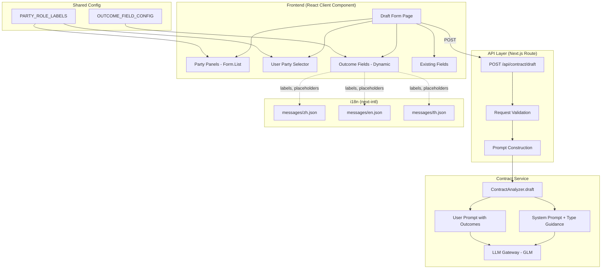

# Design Document: Contract Draft Enhancement

## Overview

This design enhances the WINAI contract drafting experience by adding three core capabilities to the existing form at `src/app/[locale]/contract/draft/page.tsx` and its backend at `src/app/api/contract/draft/route.ts`:

1. **User Party Identification** — A "I am" (`我是`) selector that lets users indicate which party they represent, so the AI can draft protective clauses favoring their interests.
2. **Multi-Party Support** — Dynamic party panels (2–10) with add/remove controls, replacing the current hardcoded Party A / Party B layout.
3. **Contract-Type-Specific Outcome Fields** — A configuration-driven set of guided input fields per contract type that ask users about desired outcomes (salary, rent, penalties, etc.) in plain language.

The AI prompt system is also enhanced with a `CONTRACT_TYPE_PROMPT_MAP` providing specialized legal guidance per contract type, new template placeholders (`{{desiredOutcomes}}`, `{{userPartyRole}}`, `{{contractTypeGuidance}}`), and a legal disclaimer requirement across all system prompts.

All new UI text is internationalized across zh, en, and th locales via the existing next-intl system.

4. **AI Precision Prompts for All Services** — Every AI service across the platform receives an enhanced system prompt conforming to a unified `Prompt_Standard`: role definition with "中泰跨境" expertise qualifier, explicit Chinese and Thai legal source references, structured output quality rules, and a mandatory legal disclaimer instruction. This ensures the general-purpose GLM model consistently behaves as a domain-specific China-Thailand cross-border legal expert across all 11 service endpoints.

### Key Design Decisions

- **Configuration-driven outcome fields**: Outcome fields are defined in a static TypeScript config object (`OUTCOME_FIELD_CONFIG`) rather than fetched from a database. This keeps the system simple and avoids an extra DB round-trip for what is essentially a static mapping.
- **Form state via Ant Design Form.List**: Multi-party support uses Ant Design's `Form.List` for the parties array, which handles dynamic add/remove natively.
- **Backward-compatible API**: The `desiredOutcomes` and `userPartyIndex` fields are optional in the API request, preserving compatibility with existing callers.
- **Prompt_Standard as a structural contract**: Rather than letting each service define prompts ad-hoc, a `Prompt_Standard` defines four mandatory elements every system prompt must contain. This makes prompt quality auditable and testable. The standard is enforced via property-based tests, not runtime checks.
- **In-place prompt enhancement, not abstraction**: Each service's prompt constant is enhanced directly rather than introducing a shared prompt builder. This avoids coupling services together and keeps each prompt self-contained and readable. The `Prompt_Standard` is a design-time contract, not a runtime abstraction.

## Architecture

The enhancement touches three layers of the existing stack without introducing new services or dependencies:



### File Changes Summary

| File | Change Type | Description |
|------|------------|-------------|
| `src/app/[locale]/contract/draft/page.tsx` | Major modify | Multi-party Form.List, user party selector, dynamic outcome fields |
| `src/app/api/contract/draft/route.ts` | Modify | Accept `userPartyIndex`, `desiredOutcomes`, variable-length `parties` array |
| `src/server/services/legal/contract.ts` | Major modify | New prompts, `CONTRACT_TYPE_PROMPT_MAP`, new template placeholders, updated `ContractDraftRequest` |
| `src/lib/contract-config.ts` | New file | `OUTCOME_FIELD_CONFIG`, `PARTY_ROLE_LABELS`, shared types |
| `messages/zh.json` | Modify | Add contract.draft.* keys for new fields |
| `messages/en.json` | Modify | Add contract.draft.* keys for new fields |
| `messages/th.json` | Modify | Add contract.draft.* keys for new fields |
| `src/app/api/chat/route.ts` | Modify | Replace SYSTEM_PROMPT with Prompt_Standard-compliant version |
| `src/server/services/legal/irac.ts` | Modify | Enhance IRAC_SYSTEM_PROMPT and COMBINED_CONCLUSION_SYSTEM_PROMPT with cross-border expertise |
| `src/server/services/legal/case-analyzer.ts` | Modify | Enhance CASE_ANALYSIS_SYSTEM_PROMPT and LITIGATION_STRATEGY_SYSTEM_PROMPT with cross-border expertise |
| `src/server/services/legal/evidence.ts` | Modify | Enhance EVIDENCE_CHECKLIST/ASSESSMENT/GAPS system prompts with cross-border evidence rules |
| `src/server/services/legal/visa.ts` | Modify | Enhance VISA_RECOMMEND/RENEWAL/CONVERSION system prompts with cross-border legal references |
| `src/server/services/legal/case-search.ts` | Modify | Enhance CASE_SEARCH/TREND_ANALYSIS/CASE_COMPARISON system prompts with cross-jurisdiction citations |
| `src/server/services/legal/jurisdiction.ts` | Modify | Enhance JURISDICTION_SYSTEM_PROMPT with cross-border conflict resolution guidance |
| `src/server/services/legal/compliance.ts` | Modify | Enhance FULL_COMPLIANCE_SYSTEM_PROMPT with cross-border regulatory frameworks |
| `src/server/services/report/generator.ts` | Modify | Enhance REPORT_SYSTEM_PROMPT with cross-border report standards and bilingual terminology |
| `src/server/services/ai/paralegal/timeline-generator.ts` | Major modify | Replace simple TIMELINE_SYSTEM_PROMPT with full Prompt_Standard-compliant version |

## Components and Interfaces

### 1. Outcome Field Configuration (`src/lib/contract-config.ts`)

This new shared module defines the outcome field schema and per-type configurations used by both the frontend (for rendering) and the API (for validation).

```typescript
export type ContractType = 'EMPLOYMENT' | 'SALE' | 'SERVICE' | 'LEASE' | 'PARTNERSHIP' | 'OTHER';

export interface OutcomeFieldDef {
  key: string;              // unique identifier, e.g. 'salary'
  inputType: 'text' | 'number' | 'textarea';
  required: boolean;
  // i18n keys are derived: `contract.draft.outcomes.{contractType}.{key}`
  // label key:       `contract.draft.outcomes.{contractType}.{key}.label`
  // placeholder key: `contract.draft.outcomes.{contractType}.{key}.placeholder`
}

export type OutcomeFieldConfig = Record<ContractType, OutcomeFieldDef[]>;

export const OUTCOME_FIELD_CONFIG: OutcomeFieldConfig = {
  EMPLOYMENT: [
    { key: 'salary', inputType: 'text', required: true },
    { key: 'probationPeriod', inputType: 'text', required: false },
    { key: 'terminationConditions', inputType: 'textarea', required: false },
    { key: 'nonCompeteScope', inputType: 'textarea', required: false },
  ],
  SALE: [
    { key: 'itemDescription', inputType: 'textarea', required: true },
    { key: 'priceAndPayment', inputType: 'text', required: true },
    { key: 'deliveryConditions', inputType: 'text', required: false },
    { key: 'warrantyTerms', inputType: 'textarea', required: false },
    { key: 'breachPenalty', inputType: 'text', required: false },
  ],
  SERVICE: [
    { key: 'serviceScope', inputType: 'textarea', required: true },
    { key: 'servicePeriod', inputType: 'text', required: true },
    { key: 'paymentSchedule', inputType: 'text', required: false },
    { key: 'qualityStandards', inputType: 'textarea', required: false },
    { key: 'breachPenalty', inputType: 'text', required: false },
  ],
  LEASE: [
    { key: 'propertyDescription', inputType: 'textarea', required: true },
    { key: 'leaseDuration', inputType: 'text', required: true },
    { key: 'monthlyRent', inputType: 'number', required: true },
    { key: 'depositAmount', inputType: 'number', required: false },
    { key: 'earlyTerminationPenalty', inputType: 'text', required: false },
  ],
  PARTNERSHIP: [
    { key: 'capitalContribution', inputType: 'text', required: true },
    { key: 'profitSharingRatio', inputType: 'text', required: true },
    { key: 'decisionMakingAuthority', inputType: 'textarea', required: false },
    { key: 'exitConditions', inputType: 'textarea', required: false },
  ],
  OTHER: [
    { key: 'freeTextOutcome', inputType: 'textarea', required: true },
  ],
};

/** Party role labels by index (0-based). Used for default role assignment. */
export const PARTY_ROLE_LABELS = {
  zh: ['甲方', '乙方', '丙方', '丁方', '戊方', '己方', '庚方', '辛方', '壬方', '癸方'],
  en: ['Party A', 'Party B', 'Party C', 'Party D', 'Party E', 'Party F', 'Party G', 'Party H', 'Party I', 'Party J'],
  th: ['ฝ่าย ก', 'ฝ่าย ข', 'ฝ่าย ค', 'ฝ่าย ง', 'ฝ่าย จ', 'ฝ่าย ฉ', 'ฝ่าย ช', 'ฝ่าย ซ', 'ฝ่าย ฌ', 'ฝ่าย ญ'],
};

export const MIN_PARTIES = 2;
export const MAX_PARTIES = 10;
```

### 2. Draft Form Page (`src/app/[locale]/contract/draft/page.tsx`)

The page component is refactored from hardcoded Party A/B fields to a dynamic form:

**User Party Selector**: A `<Select>` rendered after contract type selection. Options are derived from the current parties list (e.g., "我是 甲方 (张三)"). Defaults to index 0 (Party 1). Visually highlights the selected party's panel with a colored border via conditional CSS class.

**Multi-Party Panels**: Uses `Form.List` with name `parties`. Each panel contains: name (required), role (auto-filled from `PARTY_ROLE_LABELS`), nationality, address. An "Add Party" button appends a new panel (disabled at 10). A "Remove" button appears on panels 3+ (index ≥ 2).

**Dynamic Outcome Fields**: When `contractType` changes (via `Form.Item` `shouldUpdate` or `onValuesChange`), the component reads `OUTCOME_FIELD_CONFIG[contractType]` and renders the corresponding fields. Changing contract type clears outcome values via `form.resetFields` on the outcome field names.

**Form Submission**: Collects `parties` array, `userPartyIndex` (number), and `desiredOutcomes` (object keyed by field key) alongside existing fields. POSTs to `/api/contract/draft`.

### 3. API Route (`src/app/api/contract/draft/route.ts`)

**Request Changes**:
- Accept `parties` as an array (2–10 entries) instead of `partyAName`/`partyBName` flat fields
- Accept optional `userPartyIndex` (integer, 0-based)
- Accept optional `desiredOutcomes` (Record<string, string>)
- Validate `parties.length` is between 2 and 10; return 400 if not
- Maintain backward compatibility: if `partyAName`/`partyBName` are sent (old format), convert to `parties` array

**Prompt Construction**:
- Pass `desiredOutcomes` and `userPartyIndex` to `ContractAnalyzer.draft()` via the extended `ContractDraftRequest`

### 4. Contract Service (`src/server/services/legal/contract.ts`)

**Extended `ContractDraftRequest`**:
```typescript
export interface ContractDraftRequest {
  contractType: ContractType;
  parties: PartyInfo[];
  keyTerms: Record<string, string>;
  languages: ('zh' | 'en' | 'th')[];
  jurisdiction: JurisdictionResult;
  userPartyIndex?: number;           // NEW
  desiredOutcomes?: Record<string, string>;  // NEW
}
```

**New Constants**:
- `CONTRACT_TYPE_PROMPT_MAP`: Maps each `ContractType` to a specialized prompt supplement with legal focus areas (labor law for EMPLOYMENT, commercial law for SALE, etc.)
- Updated `CONTRACT_DRAFT_SYSTEM_PROMPT`: Enhanced with senior cross-border lawyer role, dual-jurisdiction expertise, legal disclaimer instruction
- Updated `CONTRACT_DRAFT_USER_PROMPT_TEMPLATE`: New placeholders `{{desiredOutcomes}}`, `{{userPartyRole}}`, `{{contractTypeGuidance}}`

**New Formatting Methods on `ContractAnalyzer`**:
- `formatDesiredOutcomes(outcomes: Record<string, string>)`: Formats outcome key-value pairs as structured text
- `formatUserPartyRole(parties: PartyInfo[], userPartyIndex: number)`: Returns the role string of the user's party
- `getContractTypeGuidance(contractType: ContractType)`: Looks up `CONTRACT_TYPE_PROMPT_MAP`

**Updated `draft()` method**: Populates the new placeholders and appends the type-specific guidance to the system prompt.

### 5. i18n Messages

New keys added under `contract.draft` namespace in all three locale files:

- `contract.draft.iAm` — "I am" selector label
- `contract.draft.iAmPlaceholder` — placeholder for selector
- `contract.draft.addParty` — "Add Party" button
- `contract.draft.removeParty` — "Remove" button
- `contract.draft.maxPartiesReached` — max parties message
- `contract.draft.partyLabel` — "Party {index}" template
- `contract.draft.desiredOutcomes` — section divider label
- `contract.draft.outcomes.{TYPE}.{field}.label` — field labels per type
- `contract.draft.outcomes.{TYPE}.{field}.placeholder` — field placeholders per type
- `contract.draft.validation.userPartyRequired` — validation message
- `contract.draft.validation.outcomeRequired` — validation message
- `contract.draft.validation.positiveNumber` — validation message

### 6. Prompt_Standard Definition and AI Service Prompt Enhancements (Requirement 8)

#### Prompt_Standard Structure

Every AI system prompt across the platform must contain these four mandatory elements:

```
┌─────────────────────────────────────────────────────────────┐
│ Element 1: Role Definition                                  │
│   - Specific expert title with "中泰跨境" qualifier         │
│   - e.g. "资深中泰跨境法律顾问", "中泰跨境证据管理专家"     │
├─────────────────────────────────────────────────────────────┤
│ Element 2: Legal Source References                          │
│   - Chinese law sources (《民法典》, 《劳动合同法》, etc.)    │
│   - Thai law sources (Civil and Commercial Code, etc.)      │
│   - Domain-specific statutes relevant to the service        │
├─────────────────────────────────────────────────────────────┤
│ Element 3: Output Quality Rules                             │
│   - Structured output format (JSON schema or text format)   │
│   - Professional legal language requirements                │
│   - Completeness and non-empty field rules                  │
├─────────────────────────────────────────────────────────────┤
│ Element 4: Legal Disclaimer Instruction                     │
│   - Must instruct AI to state output is "仅供参考"           │
│   - Must state output "不构成正式法律意见"                   │
│   - Must recommend consulting a licensed lawyer             │
└─────────────────────────────────────────────────────────────┘
```

#### Per-Service Enhancement Plan

The following table summarizes the current state and required changes for each service's system prompts. All services already have structured output rules (Element 3), so the main gaps are: cross-border role definition (Element 1), explicit legal source listing (Element 2), and disclaimer instruction (Element 4).

**1. Chat_Service (`src/app/api/chat/route.ts`) — SYSTEM_PROMPT**

Current state: Basic "AI法律顾问" role, mentions IRAC and Chinese/Thai law generally, has a disclaimer at the end of the prompt string but does NOT instruct the AI to append one to its output.

Enhancement:
- Role → "资深中泰跨境法律顾问"
- Add explicit Chinese legal sources: 《民法典》、《合同法》、《劳动法》、《劳动合同法》、《公司法》、《外商投资法》
- Add explicit Thai legal sources: Civil and Commercial Code, Labor Protection Act, Foreign Business Act, Immigration Act, BOI Investment Promotion Act
- Add structured response format requirements (section headers, legal citation format)
- Add disclaimer instruction: instruct the AI to append "本回复仅供参考，不构成正式法律意见。具体法律事务请咨询持牌律师。" to every response

**2. IRAC_Service (`src/server/services/legal/irac.ts`) — IRAC_SYSTEM_PROMPT**

Current state: "精通中国法律和泰国法律的资深法律分析专家", has IRAC methodology, JSON output format, but no "中泰跨境" qualifier, no explicit cross-border conflict-of-law analysis, no disclaimer instruction.

Enhancement:
- Role → "中泰跨境法律IRAC分析专家"
- Add cross-border conflict-of-law analysis instructions (法律冲突分析)
- Add explicit legal source references for both jurisdictions
- Add disclaimer instruction to output rules

**3. IRAC_Service (`src/server/services/legal/irac.ts`) — COMBINED_CONCLUSION_SYSTEM_PROMPT**

Current state: "精通中国法律和泰国法律的资深法律专家", compares two jurisdictions, but no "中泰跨境" qualifier, no explicit legal sources, no disclaimer instruction.

Enhancement:
- Role → "中泰跨境法律综合结论专家"
- Add explicit instructions to reconcile findings across Chinese and Thai jurisdictions
- Add unified actionable recommendation format
- Add disclaimer instruction

**4. Case_Analysis_Service (`src/server/services/legal/case-analyzer.ts`) — CASE_ANALYSIS_SYSTEM_PROMPT**

Current state: "精通中国法律和泰国法律的资深案件分析专家", detailed analysis steps, JSON output, but no "中泰跨境" qualifier, no cross-border procedural requirements, no disclaimer instruction.

Enhancement:
- Role → "中泰跨境案件分析专家"
- Add cross-border procedural requirements section (跨境送达、域外证据、判决承认与执行)
- Add jurisdiction-specific risk assessment instructions
- Add disclaimer instruction

**5. Case_Analysis_Service (`src/server/services/legal/case-analyzer.ts`) — LITIGATION_STRATEGY_SYSTEM_PROMPT**

Current state: "精通中国法律和泰国法律的资深诉讼策略专家", JSON output, but no "中泰跨境" qualifier, no cross-border enforcement considerations, no disclaimer instruction.

Enhancement:
- Role → "中泰跨境诉讼策略专家"
- Add litigation vs. arbitration vs. mediation strategy instructions for cross-border disputes
- Add applicable treaty references (e.g., Hague Convention applicability, bilateral agreements)
- Add cost-benefit analysis per jurisdiction
- Add disclaimer instruction

**6. Evidence_Service (`src/server/services/legal/evidence.ts`) — EVIDENCE_CHECKLIST_SYSTEM_PROMPT**

Current state: "精通中国法律和泰国法律的资深证据分析专家", detailed evidence types and strength criteria, but no "中泰跨境" qualifier, no cross-border evidence authentication requirements, no disclaimer instruction.

Enhancement:
- Role → "中泰跨境证据管理专家"
- Add cross-border evidence authentication requirements (公证认证/legalization procedures)
- Add evidence admissibility standards per jurisdiction (Chinese vs. Thai rules)
- Add Chinese procedural rules (《民事诉讼法》) and Thai procedural rules (Civil Procedure Code) references
- Add disclaimer instruction

**7. Evidence_Service — EVIDENCE_ASSESSMENT_SYSTEM_PROMPT**

Current state: "精通中国法律和泰国法律的资深证据评估专家", assessment dimensions, but no cross-border evidence challenge analysis, no disclaimer instruction.

Enhancement:
- Add explicit references to Chinese evidence rules (《民事诉讼法》) and Thai evidence rules (Civil Procedure Code)
- Add cross-border evidence challenge identification
- Add disclaimer instruction

**8. Evidence_Service — EVIDENCE_GAPS_SYSTEM_PROMPT**

Current state: "精通中国法律和泰国法律的资深证据分析专家", gap analysis, but no per-jurisdiction missing evidence identification, no disclaimer instruction.

Enhancement:
- Add instructions for identifying missing evidence items required by each jurisdiction separately
- Add specific steps for obtaining cross-border evidence (国际司法协助、领事认证)
- Add disclaimer instruction

**9. Visa_Service (`src/server/services/legal/visa.ts`) — VISA_RECOMMEND_SYSTEM_PROMPT**

Current state: "精通泰国签证政策和移民法的资深签证顾问", detailed visa types and JSON output, but no "中泰跨境" qualifier, no Chinese outbound regulations, no disclaimer instruction.

Enhancement:
- Role → "中泰签证与移民法律顾问"
- Add references to Thai Immigration Act, Work Permit regulations, BOI promotion categories
- Add Chinese outbound travel regulations (中国公民出境管理条例)
- Add disclaimer instruction

**10. Visa_Service — VISA_RENEWAL_SYSTEM_PROMPT**

Current state: "精通泰国签证政策和移民法的资深签证顾问", renewal JSON output, but no cross-border context, no disclaimer instruction.

Enhancement:
- Add renewal timeline requirements per visa category
- Add document preparation checklists
- Add common rejection reasons with mitigation strategies
- Add disclaimer instruction

**11. Visa_Service — VISA_CONVERSION_SYSTEM_PROMPT**

Current state: "精通泰国签证政策和移民法的资深签证顾问", conversion JSON output, but no cross-border context, no disclaimer instruction.

Enhancement:
- Add conversion eligibility rules between visa categories
- Add required documentation differences per conversion path
- Add processing timeline expectations
- Add disclaimer instruction

**12. Case_Search_Service (`src/server/services/legal/case-search.ts`) — CASE_SEARCH_SYSTEM_PROMPT**

Current state: "精通中国法律和泰国法律的资深案例检索专家", JSON output, but no "中泰跨境" qualifier, no proper citation format per jurisdiction, no disclaimer instruction.

Enhancement:
- Role → "中泰跨境判例检索专家"
- Add instructions for citing Chinese court decisions (裁判文书) with proper format (案号、法院、日期)
- Add instructions for citing Thai court decisions with proper format
- Add disclaimer instruction

**13. Case_Search_Service — TREND_ANALYSIS_SYSTEM_PROMPT**

Current state: "精通中国法律和泰国法律的资深裁判趋势分析专家", trend JSON output, but no cross-jurisdiction trend analysis, no disclaimer instruction.

Enhancement:
- Add instructions for analyzing judicial trends across Chinese and Thai courts separately
- Add identification of shifts in legal interpretation
- Add statistical context guidance
- Add disclaimer instruction

**14. Case_Search_Service — CASE_COMPARISON_SYSTEM_PROMPT**

Current state: "精通中国法律和泰国法律的资深案例对比分析专家", comparison JSON output, but no cross-jurisdiction comparison instructions, no disclaimer instruction.

Enhancement:
- Add instructions for comparing cases across jurisdictions
- Add highlighting of procedural and substantive law differences
- Add precedent applicability analysis
- Add disclaimer instruction

**15. Jurisdiction_Service (`src/server/services/legal/jurisdiction.ts`) — JURISDICTION_SYSTEM_PROMPT**

Current state: Already very detailed with keyword mapping, confidence scoring, and JSON output. Has "精通中国法律和泰国法律的资深法律专家" role. No "中泰跨境" qualifier, no cross-border conflict resolution guidance, no disclaimer instruction.

Enhancement:
- Role → add "中泰跨境" qualifier
- Add cross-border jurisdiction conflict resolution guidance (管辖权冲突解决)
- Add forum selection recommendations (法院选择建议)
- Add disclaimer instruction
- Preserve existing keyword mapping and confidence scoring logic

**16. Compliance_Service (`src/server/services/legal/compliance.ts`) — FULL_COMPLIANCE_SYSTEM_PROMPT**

Current state: "精通中国法律和泰国法律的合规风险分析专家", detailed risk analysis, JSON output, but no "中泰跨境" qualifier, no specific regulatory framework references, no disclaimer instruction.

Enhancement:
- Role → "中泰跨境合规分析专家"
- Add Chinese regulatory frameworks: 市场监管总局规定、外汇管理条例、税务合规要求
- Add Thai regulatory frameworks: Foreign Business Act, Revenue Code, BOI regulations
- Add cross-border compliance interaction analysis
- Add disclaimer instruction

**17. Report_Service (`src/server/services/report/generator.ts`) — REPORT_SYSTEM_PROMPT**

Current state: "精通中国法律和泰国法律的资深法律分析师", six-section report structure, JSON output, has disclaimer section in report structure but no "中泰跨境" qualifier, no citation format standards, no bilingual terminology guidance.

Enhancement:
- Role → "中泰跨境法律报告撰写专家"
- Add professional report structure standards
- Add jurisdiction-specific legal citation format requirements
- Add executive summary requirements
- Add bilingual terminology usage guidance (中英泰法律术语对照)
- Add disclaimer instruction

**18. Timeline_Service (`src/server/services/ai/paralegal/timeline-generator.ts`) — TIMELINE_SYSTEM_PROMPT**

Current state: "资深法律案件时间线分析专家", simple prompt with basic JSON output, no "中泰跨境" qualifier, no dual-jurisdiction date analysis, no statute of limitations, no disclaimer instruction. This is the most under-specified prompt.

Enhancement (major rewrite):
- Role → "中泰跨境案件时间线分析专家"
- Add instructions for identifying legally significant dates under both Chinese and Thai jurisdictions
- Add statute of limitations calculations per applicable law (中国诉讼时效/泰国 Prescription)
- Add procedural deadline mapping (立案期限、上诉期限、执行期限)
- Add cross-border timeline considerations (跨境送达时间、域外取证时间)
- Add explicit Chinese and Thai legal source references
- Add disclaimer instruction

## Data Models

### Request Payload (Frontend → API)

```typescript
interface DraftFormPayload {
  contractType: ContractType;
  parties: Array<{
    name: string;
    role: string;
    nationality?: string;
    address?: string;
  }>;
  userPartyIndex: number;  // 0-based, defaults to 0
  desiredOutcomes: Record<string, string>;  // e.g. { salary: "50000 THB/month", probationPeriod: "3 months" }
  governingLaw: string;
  disputeResolution: string;
  languages: string[];
  specialClauses?: string;
}
```

### Extended ContractDraftRequest (API → Service)

```typescript
export interface ContractDraftRequest {
  contractType: ContractType;
  parties: PartyInfo[];
  keyTerms: Record<string, string>;
  languages: ('zh' | 'en' | 'th')[];
  jurisdiction: JurisdictionResult;
  userPartyIndex?: number;
  desiredOutcomes?: Record<string, string>;
}
```

### CONTRACT_TYPE_PROMPT_MAP Structure

```typescript
const CONTRACT_TYPE_PROMPT_MAP: Record<ContractType, string> = {
  EMPLOYMENT: `【劳动合同专项指引】
重点关注：试用期条款（中国《劳动合同法》/泰国 Labor Protection Act）、
解除条件、经济补偿、竞业限制、社会保险义务...`,
  SALE: `【买卖合同专项指引】
重点关注：标的物交付与验收、质量保证与退换货、所有权转移、
不可抗力、违约金计算...`,
  SERVICE: `【服务合同专项指引】
重点关注：服务范围界定、SLA 标准、验收标准、知识产权归属、
责任上限...`,
  LEASE: `【租赁合同专项指引】
重点关注：租金调整机制、维修义务分配、转租限制、
押金退还条件...`,
  PARTNERSHIP: `【合伙协议专项指引】
重点关注：出资方式与比例、利润/亏损分配、管理权限、
僵局解决机制、退伙与解散...`,
  OTHER: `【通用合同指引】
遵循合同法一般原则，确保条款完整、权利义务对等...`,
};
```

### Outcome Field i18n Key Convention

For a contract type `SALE` and field key `itemDescription`:
- Label: `contract.draft.outcomes.SALE.itemDescription.label`
- Placeholder: `contract.draft.outcomes.SALE.itemDescription.placeholder`

This convention allows the frontend to construct i18n keys dynamically:
```typescript
const label = t(`outcomes.${contractType}.${field.key}.label`);
const placeholder = t(`outcomes.${contractType}.${field.key}.placeholder`);
```

## Correctness Properties

*A property is a characteristic or behavior that should hold true across all valid executions of a system — essentially, a formal statement about what the system should do. Properties serve as the bridge between human-readable specifications and machine-verifiable correctness guarantees.*

### Property 1: Outcome field config completeness

*For any* contract type in the set {EMPLOYMENT, SALE, SERVICE, LEASE, PARTNERSHIP, OTHER}, `OUTCOME_FIELD_CONFIG[type]` should be a non-empty array of `OutcomeFieldDef` objects, and the required fields should match the specification (e.g., EMPLOYMENT requires 'salary', SALE requires 'itemDescription' and 'priceAndPayment', etc.).

**Validates: Requirements 3.2, 5.3**

### Property 2: Party count invariant

*For any* parties array, the API validation function should accept it if and only if its length is between 2 and 10 (inclusive). Arrays with fewer than 2 or more than 10 entries should be rejected with a 400 status.

**Validates: Requirements 2.1, 2.6, 6.3, 6.4**

### Property 3: Party re-indexing after removal

*For any* party list of length N (where N > 2) and any valid removal index i (where i ≥ 2), removing the party at index i should produce a list of length N-1 where each party's index label matches its position (Party 1, Party 2, ..., Party N-1).

**Validates: Requirements 2.4**

### Property 4: Default role label assignment

*For any* party index i (0 ≤ i < 10) and any locale in {zh, en, th}, the auto-assigned default role label should equal `PARTY_ROLE_LABELS[locale][i]`.

**Validates: Requirements 2.5**

### Property 5: Outcome fields match selected contract type

*For any* contract type, the set of outcome field keys rendered by the form should exactly equal the set of keys in `OUTCOME_FIELD_CONFIG[type]`.

**Validates: Requirements 3.1, 3.3**

### Property 6: i18n key completeness for outcome fields

*For any* contract type, *for any* outcome field defined in `OUTCOME_FIELD_CONFIG[type]`, and *for any* locale in {zh, en, th}, the i18n system should contain non-empty translations for both the label key (`outcomes.{type}.{field.key}.label`) and the placeholder key (`outcomes.{type}.{field.key}.placeholder`).

**Validates: Requirements 3.5, 4.1, 4.2**

### Property 7: Prompt includes all desired outcomes

*For any* `desiredOutcomes` object with non-empty values, the constructed user prompt string should contain every value from the outcomes object.

**Validates: Requirements 3.7, 6.5, 7.7**

### Property 8: Prompt includes user party protection instruction

*For any* valid `userPartyIndex` and parties list where `parties[userPartyIndex]` exists, the constructed prompt should contain the party's role name and the protective instruction text ("请从{角色}的角度起草合同，在法律允许范围内最大程度保护{角色}的权益").

**Validates: Requirements 7.6**

### Property 9: Numeric outcome field validation

*For any* string that is not a valid positive number (including negative numbers, zero, non-numeric strings, empty strings), validation on a numeric-type outcome field should reject the value. *For any* valid positive number string, validation should accept it.

**Validates: Requirements 5.4**

### Property 10: Party name non-empty validation

*For any* parties array, if any party has an empty or whitespace-only name, form validation should fail and prevent submission.

**Validates: Requirements 5.5**

### Property 11: CONTRACT_TYPE_PROMPT_MAP completeness

*For any* contract type in {EMPLOYMENT, SALE, SERVICE, LEASE, PARTNERSHIP, OTHER}, `CONTRACT_TYPE_PROMPT_MAP[type]` should be a non-empty string containing type-specific legal guidance.

**Validates: Requirements 7.2**

### Property 12: All system prompts include disclaimer instruction

*For any* system prompt string across all AI services — including SYSTEM_PROMPT (chat), IRAC_SYSTEM_PROMPT, COMBINED_CONCLUSION_SYSTEM_PROMPT, CASE_ANALYSIS_SYSTEM_PROMPT, LITIGATION_STRATEGY_SYSTEM_PROMPT, EVIDENCE_CHECKLIST_SYSTEM_PROMPT, EVIDENCE_ASSESSMENT_SYSTEM_PROMPT, EVIDENCE_GAPS_SYSTEM_PROMPT, VISA_RECOMMEND_SYSTEM_PROMPT, VISA_RENEWAL_SYSTEM_PROMPT, VISA_CONVERSION_SYSTEM_PROMPT, CASE_SEARCH_SYSTEM_PROMPT, TREND_ANALYSIS_SYSTEM_PROMPT, CASE_COMPARISON_SYSTEM_PROMPT, JURISDICTION_SYSTEM_PROMPT, FULL_COMPLIANCE_SYSTEM_PROMPT, REPORT_SYSTEM_PROMPT, TIMELINE_SYSTEM_PROMPT, CONTRACT_DRAFT_SYSTEM_PROMPT, and CONTRACT_REVIEW_SYSTEM_PROMPT — the prompt should contain a disclaimer instruction about content being for reference only and not constituting formal legal advice.

**Validates: Requirements 7.10, 8.19**

### Property 13: Backward compatibility — requests without new fields are valid

*For any* valid old-format request (containing contractType, partyAName, partyBName, governingLaw, disputeResolution, languages, but no desiredOutcomes or userPartyIndex), the API should process it successfully without error.

**Validates: Requirements 6.6**

### Property 14: Required outcome field validation

*For any* contract type and *for any* outcome field marked as `required: true` in `OUTCOME_FIELD_CONFIG[type]`, submitting the form with that field empty should fail validation.

**Validates: Requirements 5.2**

### Property 15: All system prompts conform to Prompt_Standard

*For any* system prompt constant across all AI services, the prompt string should contain all four Prompt_Standard elements: (a) a role definition containing the "中泰跨境" expertise qualifier, (b) at least one Chinese legal source reference and at least one Thai legal source reference, (c) output quality rules specifying structured format requirements, and (d) a legal disclaimer instruction containing "仅供参考" and "不构成正式法律意见".

**Validates: Requirements 8.19**

### Property 16: System prompt is first message in conversation context

*For any* AI service that calls the LLM gateway, the messages array passed to `gateway.chat()` should have a system-role message as its first element, and that message's content should equal the service's designated system prompt constant.

**Validates: Requirements 8.20**

## Error Handling

### Frontend Errors

| Scenario | Handling |
|----------|----------|
| Contract type not selected | Ant Design form validation prevents submission, shows required message |
| Required outcome field empty | Form validation error on the specific field with i18n message |
| Numeric field with invalid value | Custom validator rejects non-positive-number input, shows `validation.positiveNumber` message |
| Party name empty | Form validation error on the party panel's name field |
| User party not selected | Form validation error on the "I am" selector (should not normally occur due to default) |
| API returns 400 | `message.error()` displays the error message from the response body |
| API returns 503 (LLM unavailable) | `message.error()` displays service unavailable message |
| Network failure | `message.error()` with generic error from catch block |

### API Errors

| Scenario | Response |
|----------|----------|
| `parties.length < 2` or `> 10` | 400 with descriptive error message |
| Missing `contractType` | 400 with "缺少必填字段" |
| Missing party names | 400 with "缺少必填字段" |
| `userPartyIndex` out of range | Silently default to 0 (defensive, not a hard error) |
| LLM gateway unavailable | 503 with "AI 服务暂不可用" |
| LLM returns empty/degraded | Return degraded draft text (existing behavior) |
| Unexpected exception | 500 with error message |

### Service-Level Errors

- If `CONTRACT_TYPE_PROMPT_MAP` has no entry for a type, fall back to the `OTHER` guidance text.
- If `desiredOutcomes` is empty or undefined, the `{{desiredOutcomes}}` placeholder is replaced with an empty string (no outcomes section in prompt).
- If `userPartyIndex` is undefined, the `{{userPartyRole}}` placeholder is replaced with a generic instruction (no party-specific protection).

### Prompt Enhancement Errors

- If a system prompt constant is accidentally emptied or truncated during editing, the property-based tests (Property 15) will catch the regression before deployment.
- If the LLM gateway receives an empty system prompt, it will still function but produce lower-quality output. This is a degraded state, not a hard error.
- If a service's messages array is constructed without a system prompt as the first message, the LLM will lack the expert persona context. Property 16 tests catch this structurally.

## Testing Strategy

### Property-Based Testing

Library: **fast-check** (TypeScript property-based testing library)

Each property test runs a minimum of 100 iterations with randomly generated inputs. Tests are tagged with the design property they validate.

Properties to implement as property-based tests:
- Property 1 (Outcome field config completeness) — Generate random contract types, verify config structure
- Property 2 (Party count invariant) — Generate arrays of length 0–15, verify validation accepts [2,10] only
- Property 3 (Party re-indexing) — Generate party lists of length 3–10, remove at random valid index, verify sequential indexing
- Property 4 (Default role label assignment) — Generate random index 0–9 and random locale, verify label lookup
- Property 5 (Outcome fields match type) — Generate random contract type, verify field keys match config
- Property 6 (i18n key completeness) — Generate random type × field × locale combinations, verify keys exist
- Property 7 (Prompt includes outcomes) — Generate random outcome key-value maps, verify all values appear in prompt
- Property 8 (Prompt includes user party protection) — Generate random party lists and valid index, verify prompt text
- Property 9 (Numeric validation) — Generate random strings (including edge cases), verify positive number validation
- Property 10 (Party name validation) — Generate party arrays with random empty/whitespace names, verify validation fails
- Property 11 (Type prompt map completeness) — Generate random contract type, verify map entry exists
- Property 12 (Disclaimer in all prompts) — Iterate over all 20 system prompt constants, verify each contains disclaimer text
- Property 13 (Backward compatibility) — Generate old-format requests, verify API processes them
- Property 14 (Required outcome field validation) — Generate random type, pick a required field, leave it empty, verify validation fails
- Property 15 (Prompt_Standard conformance) — Iterate over all system prompt constants, verify each contains: "中泰跨境" role qualifier, at least one Chinese law reference, at least one Thai law reference, output format rules, and disclaimer instruction
- Property 16 (System prompt ordering) — For each service's chat call, verify the messages array starts with a system-role message matching the service's prompt constant

### Unit Testing

Unit tests complement property tests for specific examples and edge cases:
- Verify the "Add Party" button is disabled when party count is 10 (edge case from 2.7)
- Verify default userPartyIndex is 0 (example from 1.5)
- Verify `CONTRACT_DRAFT_USER_PROMPT_TEMPLATE` contains all three new placeholders (examples from 7.3, 7.4, 7.5)
- Verify `CONTRACT_DRAFT_SYSTEM_PROMPT` contains the senior lawyer role definition (example from 7.1)
- Verify consultation and review system prompts contain expected role definitions (examples from 7.8, 7.9)
- Verify form clears outcome values when contract type changes (example from 3.4)
- Verify backward-compatible request mapping from old partyAName/partyBName format
- Verify Chat_Service SYSTEM_PROMPT contains "资深中泰跨境法律顾问" role and IRAC methodology reference (example from 8.1)
- Verify IRAC_SYSTEM_PROMPT contains "中泰跨境法律IRAC分析专家" role and conflict-of-law instructions (example from 8.2)
- Verify COMBINED_CONCLUSION_SYSTEM_PROMPT contains cross-border reconciliation instructions (example from 8.3)
- Verify CASE_ANALYSIS_SYSTEM_PROMPT contains "中泰跨境案件分析专家" role and cross-border procedural requirements (example from 8.4)
- Verify LITIGATION_STRATEGY_SYSTEM_PROMPT contains "中泰跨境诉讼策略专家" role and treaty references (example from 8.5)
- Verify EVIDENCE_CHECKLIST_SYSTEM_PROMPT contains "中泰跨境证据管理专家" role and 公证认证 requirements (example from 8.6)
- Verify EVIDENCE_ASSESSMENT_SYSTEM_PROMPT references 《民事诉讼法》 and Civil Procedure Code (example from 8.7)
- Verify EVIDENCE_GAPS_SYSTEM_PROMPT contains per-jurisdiction missing evidence instructions (example from 8.8)
- Verify VISA_RECOMMEND_SYSTEM_PROMPT contains "中泰签证与移民法律顾问" role and BOI references (example from 8.9)
- Verify VISA_RENEWAL_SYSTEM_PROMPT contains renewal timeline and rejection reasons (example from 8.10)
- Verify VISA_CONVERSION_SYSTEM_PROMPT contains conversion eligibility rules (example from 8.11)
- Verify CASE_SEARCH_SYSTEM_PROMPT contains "中泰跨境判例检索专家" role and citation format instructions (example from 8.12)
- Verify TREND_ANALYSIS_SYSTEM_PROMPT contains cross-jurisdiction trend analysis instructions (example from 8.13)
- Verify CASE_COMPARISON_SYSTEM_PROMPT contains cross-jurisdiction comparison instructions (example from 8.14)
- Verify JURISDICTION_SYSTEM_PROMPT contains cross-border conflict resolution guidance (example from 8.15)
- Verify FULL_COMPLIANCE_SYSTEM_PROMPT contains "中泰跨境合规分析专家" role and regulatory framework references (example from 8.16)
- Verify REPORT_SYSTEM_PROMPT contains "中泰跨境法律报告撰写专家" role and bilingual terminology guidance (example from 8.17)
- Verify TIMELINE_SYSTEM_PROMPT contains "中泰跨境案件时间线分析专家" role and statute of limitations instructions (example from 8.18)

### Test File Organization

```
tests/
  properties/
    contract-draft-config.test.ts      # Properties 1, 4, 5, 11
    contract-draft-validation.test.ts  # Properties 2, 9, 10, 14
    contract-draft-prompt.test.ts      # Properties 7, 8, 12, 15
    contract-draft-i18n.test.ts        # Property 6
    contract-draft-party.test.ts       # Property 3
    contract-draft-api.test.ts         # Property 13
    prompt-standard.test.ts            # Property 15 (dedicated), Property 16
  unit/
    contract-draft-enhancement.test.ts # Unit/example tests for Requirements 1-7
    ai-prompt-enhancement.test.ts      # Unit/example tests for Requirement 8 (per-service content checks)
```

Each property test file follows this tagging convention:
```typescript
// Feature: contract-draft-enhancement, Property 2: Party count invariant
it('should accept parties arrays with length in [2, 10] and reject others', () => {
  fc.assert(fc.property(
    fc.array(fc.record({ name: fc.string(), role: fc.string() }), { minLength: 0, maxLength: 15 }),
    (parties) => {
      const isValid = validatePartiesCount(parties);
      return isValid === (parties.length >= 2 && parties.length <= 10);
    }
  ), { numRuns: 100 });
});
```
