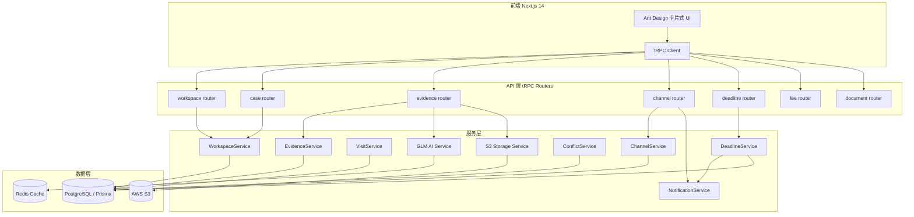

# 技术设计文档：律师工作空间（Lawyer Workspace）

## 概述

律师工作空间是 winaii.com 中泰法律平台的 SaaS 核心模块，为执业律师提供案件管理、智能证据分析、律师-客户沟通、期限追踪、费用记录等一站式工作环境。

本模块基于现有 Next.js 14 + TypeScript + PostgreSQL（Prisma）+ Redis + AWS S3 + GLM AI + Ant Design 技术栈构建，与平台现有用户认证、订阅支付、审计日志体系深度集成。

### 设计目标

- 每位律师拥有物理隔离的专属工作空间（S3 路径 + 数据库行级权限）
- AI 辅助（GLM AI）贯穿证据分类、会见摘要生成等核心流程
- 卡片式 UI，大字号大间距，降低高强度工作中的视觉疲劳
- 通过 tRPC + React Query 实现类型安全的前后端通信

---

## 架构

### 整体架构图



### 关键架构决策

1. **tRPC 路由分层**：每个业务域（案件、证据、频道等）独立 router，通过 `createTRPCRouter` 组合，与现有 `/api/trpc/[trpc]` 入口无缝集成。
2. **行级权限（RLS 模拟）**：所有数据库查询在 Service 层强制附加 `lawyerId` 过滤条件，不依赖数据库 RLS，保持 Prisma 兼容性。
3. **S3 路径隔离**：所有文件操作通过 `StorageService` 统一管理，强制前缀为 `workspaces/{lawyerId}/`，禁止跨律师路径访问。
4. **AI 异步处理**：证据分类通过 Redis 队列异步执行，避免上传接口超时；会见摘要为同步流式响应。
5. **通知系统**：站内通知写入 `Notification` 表，前端通过 tRPC subscription 或轮询获取未读数。

---

## 组件与接口

### tRPC Router 结构

```
src/server/routers/
├── workspace.ts       # 工作空间初始化、配额查询
├── case.ts            # 案件 CRUD、时间线、冲突检查
├── evidence.ts        # 证据上传、AI 分类、清单生成
├── visit.ts           # 会见摘要生成、会见记录
├── channel.ts         # 沟通频道、消息发送
├── deadline.ts        # 期限管理、提醒
├── fee.ts             # 费用记录
├── document.ts        # 文件版本管理
└── notification.ts    # 站内通知
```

### 核心服务接口

#### WorkspaceService

```typescript
interface WorkspaceService {
  // 律师注册后自动调用
  initWorkspace(lawyerId: string, planTier: LawyerPlanTier): Promise<Workspace>
  getStorageUsage(lawyerId: string): Promise<{ used: number; quota: number }>
  checkQuota(lawyerId: string, fileSize: number): Promise<boolean>
}
```

#### EvidenceService

```typescript
interface EvidenceService {
  uploadEvidence(params: UploadEvidenceParams): Promise<Evidence>
  triggerClassification(evidenceId: string): Promise<void>  // 异步，写入 Redis 队列
  generateEvidenceList(caseId: string, lawyerId: string): Promise<EvidenceListDoc>
  exportEvidenceList(caseId: string, format: 'pdf' | 'docx'): Promise<Buffer>
  importEvidenceList(file: Buffer, format: 'pdf' | 'docx'): Promise<EvidenceListData>
}
```

#### AIService（GLM AI 封装）

```typescript
interface AIService {
  classifyEvidence(evidence: EvidenceInput): Promise<ClassificationResult>
  generateVisitSummary(caseId: string, lawyerId: string): Promise<string>
}

interface ClassificationResult {
  category: 'VALID' | 'INVALID' | 'NEEDS_SUPPLEMENT'
  proofPurpose: string
  legalBasis: string[]
  strength: 'STRONG' | 'MEDIUM' | 'WEAK'
  similarCase: string
}
```

#### StorageService（S3 封装）

```typescript
interface StorageService {
  upload(lawyerId: string, caseId: string, file: Buffer, fileName: string): Promise<string>  // 返回 s3Key
  getPresignedUrl(s3Key: string, lawyerId: string): Promise<string>  // 验证路径归属
  delete(s3Key: string, lawyerId: string): Promise<void>
  // s3Key 格式: workspaces/{lawyerId}/cases/{caseId}/{fileId}/{fileName}
}
```

#### NotificationService

```typescript
interface NotificationService {
  send(params: {
    userId: string
    type: NotificationType
    title: string
    body: string
    relatedId?: string  // caseId / deadlineId / channelId
  }): Promise<void>
  getUnread(userId: string): Promise<Notification[]>
  markRead(notificationId: string, userId: string): Promise<void>
}
```

### 前端页面结构

```
src/app/[locale]/workspace/
├── page.tsx                    # 仪表盘：今日待办 + 紧急期限
├── cases/
│   ├── page.tsx                # 案件列表（卡片式）
│   ├── new/page.tsx            # 新建案件（含冲突检查）
│   └── [caseId]/
│       ├── page.tsx            # 案件详情
│       ├── evidence/page.tsx   # 证据管理
│       ├── visit/page.tsx      # 会见记录
│       ├── channel/page.tsx    # 沟通频道
│       ├── deadlines/page.tsx  # 期限管理
│       ├── fees/page.tsx       # 费用记录
│       └── documents/page.tsx  # 文件版本
├── settings/page.tsx           # 工作空间设置、套餐管理
└── notifications/page.tsx      # 通知中心
```

---

## 数据模型

以下为新增 Prisma 模型，追加至现有 `schema.prisma`。

### 枚举类型

```prisma
enum LawyerPlanTier {
  BASIC        // 基础版 5GB
  PROFESSIONAL // 专业版 50GB
  FIRM         // 事务所版 500GB
}

enum WorkspaceStatus {
  ACTIVE
  READONLY     // 订阅到期
  SUSPENDED
}

enum CaseStatus {
  OPEN
  IN_PROGRESS
  CLOSED
  ARCHIVED
}

enum EvidenceCategory {
  VALID
  INVALID
  NEEDS_SUPPLEMENT
  PENDING_CLASSIFICATION  // AI 待处理
}

enum EvidenceStrength {
  STRONG
  MEDIUM
  WEAK
}

enum DeadlineType {
  STATUTE_OF_LIMITATIONS  // 诉讼时效
  COURT_DATE              // 开庭日期
  APPEAL_DEADLINE         // 上诉截止
  OTHER
}

enum FeeVisibility {
  INTERNAL_ONLY
  CLIENT_VISIBLE
}

enum ChannelMessageType {
  TEXT
  FILE
  STAGE_UPDATE
  SYSTEM
}

enum AuditAction {
  VIEW
  DOWNLOAD
  DELETE
  UPLOAD
  VERSION_RESTORE
}

enum NotificationType {
  DEADLINE_7DAY
  DEADLINE_1DAY
  DEADLINE_OVERDUE
  CHANNEL_MESSAGE
  STAGE_UPDATE
  EVIDENCE_CLASSIFIED
}
```

### 核心数据模型

```prisma
// 律师工作空间
model LawyerWorkspace {
  id            String          @id @default(cuid())
  lawyerId      String          @unique  // 关联 User.id
  planTier      LawyerPlanTier  @default(BASIC)
  status        WorkspaceStatus @default(ACTIVE)
  storageQuotaGB Int            @default(5)   // 套餐基础配额（GB）
  storageAddOnGB Int            @default(0)   // 额外购买配额（GB）
  storageUsedBytes BigInt       @default(0)
  s3BasePath    String          // workspaces/{lawyerId}/
  subscriptionEndDate DateTime?
  firmId        String?         // 律所 ID（事务所版）
  createdAt     DateTime        @default(now())
  updatedAt     DateTime        @updatedAt

  lawyer        User            @relation(fields: [lawyerId], references: [id])
  cases         Case[]
  lawyerSubscription LawyerSubscription?

  @@index([lawyerId])
}

// 律师专属订阅（区别于平台通用 Subscription）
model LawyerSubscription {
  id          String          @id @default(cuid())
  workspaceId String          @unique
  planTier    LawyerPlanTier
  startDate   DateTime        @default(now())
  endDate     DateTime
  autoRenew   Boolean         @default(true)
  createdAt   DateTime        @default(now())
  updatedAt   DateTime        @updatedAt

  workspace   LawyerWorkspace @relation(fields: [workspaceId], references: [id])
  addOns      StorageAddOn[]
}

// 存储扩充包
model StorageAddOn {
  id             String             @id @default(cuid())
  subscriptionId String
  addedGB        Int
  purchasedAt    DateTime           @default(now())

  subscription   LawyerSubscription @relation(fields: [subscriptionId], references: [id])
}

// 案件
model Case {
  id            String      @id @default(cuid())
  workspaceId   String
  caseNumber    String      // 案件编号
  title         String
  caseType      String      // 案由
  status        CaseStatus  @default(OPEN)
  clientId      String?     // 关联 User.id（客户）
  clientName    String      // 当事人姓名（可能非平台用户）
  opposingParty String?     // 对立方信息
  filedAt       DateTime    // 立案日期
  closedAt      DateTime?
  createdAt     DateTime    @default(now())
  updatedAt     DateTime    @updatedAt

  workspace     LawyerWorkspace  @relation(fields: [workspaceId], references: [id])
  client        User?            @relation("ClientCases", fields: [clientId], references: [id])
  timeline      CaseTimelineEvent[]
  evidences     Evidence[]
  visitRecords  VisitRecord[]
  channel       Channel?
  deadlines     Deadline[]
  feeRecords    FeeRecord[]
  documents     CaseDocument[]

  @@index([workspaceId, status])
  @@index([clientId])
}

// 案件时间线事件
model CaseTimelineEvent {
  id          String   @id @default(cuid())
  caseId      String
  eventType   String   // 'CASE_CREATED' | 'STATUS_CHANGED' | 'EVIDENCE_ADDED' | 'VISIT_RECORDED' | ...
  description String   @db.Text
  operatorId  String   // 操作人 User.id
  metadata    Json?
  occurredAt  DateTime @default(now())

  case        Case     @relation(fields: [caseId], references: [id])

  @@index([caseId, occurredAt])
}

// 证据
model Evidence {
  id              String           @id @default(cuid())
  caseId          String
  fileName        String
  fileSize        BigInt
  mimeType        String
  s3Key           String           // workspaces/{lawyerId}/cases/{caseId}/evidence/{fileId}/...
  category        EvidenceCategory @default(PENDING_CLASSIFICATION)
  proofPurpose    String?          @db.Text
  legalBasis      String[]
  strength        EvidenceStrength?
  similarCase     String?          @db.Text
  classifiedAt    DateTime?
  classifyError   String?
  uploadedBy      String           // User.id
  createdAt       DateTime         @default(now())
  updatedAt       DateTime         @updatedAt

  case            Case             @relation(fields: [caseId], references: [id])
  auditLogs       WorkspaceAuditLog[]

  @@index([caseId, category])
}

// 会见记录
model VisitRecord {
  id              String   @id @default(cuid())
  caseId          String
  lawyerId        String
  visitedAt       DateTime
  summary         String?  @db.Text  // AI 生成的会见前摘要（快照）
  outcome         String   @db.Text  // 处理结果
  nextSteps       String   @db.Text  // 下一步策略
  createdAt       DateTime @default(now())

  case            Case     @relation(fields: [caseId], references: [id])

  @@index([caseId, visitedAt])
}

// 沟通频道
model Channel {
  id        String    @id @default(cuid())
  caseId    String    @unique
  createdAt DateTime  @default(now())

  case      Case      @relation(fields: [caseId], references: [id])
  messages  ChannelMessage[]
}

// 频道消息
model ChannelMessage {
  id          String             @id @default(cuid())
  channelId   String
  senderId    String             // User.id
  messageType ChannelMessageType @default(TEXT)
  content     String             @db.Text
  s3Key       String?            // 附件
  metadata    Json?
  createdAt   DateTime           @default(now())

  channel     Channel            @relation(fields: [channelId], references: [id])

  @@index([channelId, createdAt])
}

// 期限
model Deadline {
  id            String       @id @default(cuid())
  caseId        String
  deadlineType  DeadlineType
  title         String
  dueDate       DateTime
  isHandled     Boolean      @default(false)
  handledAt     DateTime?
  createdAt     DateTime     @default(now())
  updatedAt     DateTime     @updatedAt

  case          Case         @relation(fields: [caseId], references: [id])
  notifications Notification[]

  @@index([caseId, dueDate])
  @@index([dueDate, isHandled])
}

// 费用记录
model FeeRecord {
  id          String        @id @default(cuid())
  caseId      String
  lawyerId    String
  description String        @db.Text
  hours       Decimal       @db.Decimal(6, 2)
  amount      Decimal       @db.Decimal(10, 2)
  currency    String        @default("CNY")
  workDate    DateTime      @db.Date
  visibility  FeeVisibility @default(INTERNAL_ONLY)
  createdAt   DateTime      @default(now())
  updatedAt   DateTime      @updatedAt

  case        Case          @relation(fields: [caseId], references: [id])

  @@index([caseId, workDate])
}

// 案件文件（支持版本管理）
model CaseDocument {
  id          String    @id @default(cuid())
  caseId      String
  title       String
  currentVersionId String?  // 当前有效版本
  createdAt   DateTime  @default(now())
  updatedAt   DateTime  @updatedAt

  case        Case      @relation(fields: [caseId], references: [id])
  versions    CaseDocumentVersion[]

  @@index([caseId])
}

// 案件文件版本
model CaseDocumentVersion {
  id            String   @id @default(cuid())
  documentId    String
  versionNumber Int
  s3Key         String
  fileSize      BigInt
  uploadedBy    String   // User.id
  notes         String?  @db.Text
  isActive      Boolean  @default(false)  // 当前有效版本标记
  createdAt     DateTime @default(now())

  document      CaseDocument @relation(fields: [documentId], references: [id])
  auditLogs     WorkspaceAuditLog[]

  @@unique([documentId, versionNumber])
  @@index([documentId])
}

// 工作空间专属审计日志（独立于平台 AuditLog）
model WorkspaceAuditLog {
  id          String      @id @default(cuid())
  workspaceId String
  operatorId  String      // User.id
  action      AuditAction
  resourceType String     // 'EVIDENCE' | 'DOCUMENT_VERSION'
  evidenceId  String?
  documentVersionId String?
  s3Key       String?
  ipAddress   String?
  createdAt   DateTime    @default(now())

  evidence    Evidence?          @relation(fields: [evidenceId], references: [id])
  docVersion  CaseDocumentVersion? @relation(fields: [documentVersionId], references: [id])

  @@index([workspaceId, createdAt])
  @@index([operatorId, createdAt])
}

// 站内通知
model Notification {
  id          String           @id @default(cuid())
  userId      String           // 接收人 User.id
  type        NotificationType
  title       String
  body        String           @db.Text
  isRead      Boolean          @default(false)
  relatedId   String?          // caseId / deadlineId / channelId
  deadlineId  String?
  createdAt   DateTime         @default(now())

  deadline    Deadline?        @relation(fields: [deadlineId], references: [id])

  @@index([userId, isRead, createdAt])
}
```

### 存储配额常量

| 套餐 | 基础配额 | 扩充包单位 |
|------|---------|-----------|
| BASIC | 5 GB | 10 GB/包 |
| PROFESSIONAL | 50 GB | 50 GB/包 |
| FIRM | 500 GB | 200 GB/包 |

### S3 路径规范

```
workspaces/{lawyerId}/
├── cases/{caseId}/
│   ├── evidence/{evidenceId}/{fileName}
│   └── documents/{documentId}/v{versionNumber}/{fileName}
```

### Redis 缓存键规范

```
workspace:quota:{lawyerId}          → 存储用量缓存（TTL 5min）
evidence:classify:queue             → 证据分类任务队列（List）
evidence:classify:status:{evidenceId} → 分类任务状态（TTL 1h）
notification:unread:{userId}        → 未读通知数（TTL 1min）
```

---

## 错误处理

### 存储配额超限

```typescript
// StorageService.upload() 前置检查
if (usedBytes + fileSize > quotaBytes) {
  throw new TRPCError({
    code: 'FORBIDDEN',
    message: 'STORAGE_QUOTA_EXCEEDED',  // 前端根据 code 展示升级套餐提示
  })
}
```

### GLM AI 调用失败

```typescript
// EvidenceClassifier 异步 worker
try {
  const result = await aiService.classifyEvidence(evidence)
  await prisma.evidence.update({ where: { id }, data: { ...result, classifiedAt: new Date() } })
} catch (err) {
  await prisma.evidence.update({
    where: { id },
    data: { category: 'PENDING_CLASSIFICATION', classifyError: err.message },
  })
  // 写回队列，延迟 5 分钟重试，最多 3 次
  await redis.zadd('evidence:classify:retry', Date.now() + 300_000, evidenceId)
}
```

### 订阅到期只读

```typescript
// tRPC middleware
const requireActiveWorkspace = t.middleware(async ({ ctx, next }) => {
  const ws = await getWorkspace(ctx.session.user.id)
  if (ws.status === 'READONLY') {
    throw new TRPCError({ code: 'FORBIDDEN', message: 'WORKSPACE_READONLY' })
  }
  return next({ ctx: { ...ctx, workspace: ws } })
})
```

### 权限越权访问

所有 Case / Evidence / Channel 查询均通过 `workspaceId` 关联验证，确保律师只能访问自己工作空间内的数据：

```typescript
// 示例：case router
getCaseById: protectedProcedure
  .input(z.object({ caseId: z.string() }))
  .query(async ({ ctx, input }) => {
    const ws = await getWorkspaceByLawyerId(ctx.session.user.id)
    const case_ = await prisma.case.findFirst({
      where: { id: input.caseId, workspaceId: ws.id },  // 强制 workspaceId 过滤
    })
    if (!case_) throw new TRPCError({ code: 'NOT_FOUND' })
    return case_
  })
```

---

## 正确性属性

*属性（Property）是在系统所有有效执行中都应成立的特征或行为——本质上是对系统应做什么的形式化陈述。属性是人类可读规范与机器可验证正确性保证之间的桥梁。*


### 属性 1：工作空间自动创建

*对于任意* 完成注册的律师用户，系统应自动创建一条 `LawyerWorkspace` 记录，且该记录的 `lawyerId` 与注册用户 ID 一致。

**验证需求：1.1**

---

### 属性 2：S3 路径格式与隔离性

*对于任意* 两个不同的律师，其工作空间的 `s3BasePath` 应满足：
1. 格式符合 `workspaces/{lawyerId}/`
2. 两者互不为对方的路径前缀（物理隔离）

**验证需求：1.2, 1.4**

---

### 属性 3：套餐配额初始化

*对于任意* 套餐等级（BASIC / PROFESSIONAL / FIRM），创建工作空间后 `storageQuotaGB` 应等于该套餐对应的预定义配额值（5 / 50 / 500 GB）。

**验证需求：1.3**

---

### 属性 4：存储配额叠加

*对于任意* 初始配额值和任意扩充包容量，购买扩充包后工作空间的总有效配额应等于套餐基础配额加上所有扩充包容量之和。

**验证需求：2.3**

---

### 属性 5：配额超限拒绝上传

*对于任意* 已用存储量和任意文件大小，当两者之和超过工作空间总配额时，上传操作应被拒绝并返回 `STORAGE_QUOTA_EXCEEDED` 错误；当两者之和不超过配额时，上传应被允许。

**验证需求：2.4**

---

### 属性 6：订阅到期只读

*对于任意* 订阅已到期的工作空间，所有写操作（新建案件、上传文件）应返回 `WORKSPACE_READONLY` 错误，而读操作应正常返回数据。

**验证需求：2.6**

---

### 属性 7：律师案件访问隔离

*对于任意* 两个不同的律师 A 和 B，律师 A 尝试访问律师 B 工作空间内的任意案件时，系统应返回 `NOT_FOUND` 或 `FORBIDDEN` 错误，而不返回案件数据。

**验证需求：3.4**

---

### 属性 8：FirmAdmin 案件可见性

*对于任意* 律所管理员和该律所下任意律师的任意案件，FirmAdmin 的案件查询应能返回该案件数据。

**验证需求：3.5**

---

### 属性 9：证据分类结果枚举约束

*对于任意* 证据输入，AI 分类完成后 `category` 字段的值应始终是 `VALID`、`INVALID`、`NEEDS_SUPPLEMENT` 三者之一，不存在其他值。

**验证需求：4.2**

---

### 属性 10：会见摘要长度约束

*对于任意* 案件（无论时间线事件数量多少、会见记录数量多少），生成的会见摘要字符串长度不应超过 500 个字符。

**验证需求：5.1**

---

### 属性 11：频道消息不可删除

*对于任意* 频道中已存在的消息集合，执行任何删除操作后，消息总数不应减少（系统应拒绝删除请求）。

**验证需求：6.5**

---

### 属性 12：客户频道访问隔离

*对于任意* 两个不同的客户 A 和 B，客户 A 尝试访问客户 B 参与案件的沟通频道时，系统应返回 `FORBIDDEN` 错误。

**验证需求：6.6**

---

### 属性 13：期限提醒触发时机

*对于任意* 期限记录，当当前时间距截止日期恰好为 7 天或 1 天时，系统应为关联律师创建对应类型的 `Notification` 记录；当距离超过 7 天时，不应创建提醒通知。

**验证需求：7.2, 7.3**

---

### 属性 14：费用汇总一致性

*对于任意* 案件下的费用记录集合，按案件汇总的总金额应等于该案件下所有费用记录 `amount` 字段的算术和。

**验证需求：8.2**

---

### 属性 15：利益冲突检测正确性

*对于任意* 律师工作空间内的现有案件集合和任意新案件，当且仅当新案件的对立方信息与现有案件的当事人信息存在字符串重叠时，冲突检测函数应返回包含冲突案件列表的结果；否则返回空冲突列表。

**验证需求：9.2, 9.3**

---

### 属性 16：文件版本单调递增

*对于任意* 案件文件，每次上传新版本后，该文件的版本总数应比上传前增加 1，且所有历史版本的 `s3Key` 均可被查询到（不丢失）。

**验证需求：10.1**

---

### 属性 17：审计日志完整性与不可篡改

*对于任意* 文件访问、下载或删除操作，操作完成后审计日志表中应存在一条包含操作类型、操作人 ID、操作时间和文件标识的记录；且对审计日志的删除或更新操作应被系统拒绝。

**验证需求：11.1, 11.2**

---

### 属性 18：证据清单序列化往返

*对于任意* 有效的证据清单数据对象，将其导出为 PDF 或 Word 格式后再导入，所得数据结构应与原始对象在所有字段上等价（往返属性）。

**验证需求：12.3**

---

## 测试策略

### 双轨测试方法

本功能采用单元测试与基于属性的测试（PBT）相结合的方式，两者互补，共同保证正确性。

**单元测试**关注：
- 具体示例（套餐配额常量验证、AI 失败降级处理、仪表盘组件渲染）
- 集成点（tRPC router 与 Service 层的交互）
- 边界条件（配额恰好等于上限时的行为）

**属性测试**关注：
- 上述 18 条正确性属性的通用验证
- 通过随机输入覆盖大量边界情况

### 属性测试配置

- 测试库：`fast-check`（已在 `package.json` devDependencies 中）
- 每条属性测试最少运行 **100 次**迭代
- 每条属性测试必须包含注释标注对应设计属性：

```typescript
// Feature: lawyer-workspace, Property 5: 配额超限拒绝上传
it('quota exceeded rejects upload', () => {
  fc.assert(
    fc.property(
      fc.bigInt({ min: 1n }),  // usedBytes
      fc.bigInt({ min: 1n }),  // fileSize
      fc.bigInt({ min: 1n }),  // quotaBytes
      (used, size, quota) => {
        const willExceed = used + size > quota
        const result = checkQuota(used, size, quota)
        return willExceed ? result === false : result === true
      }
    ),
    { numRuns: 100 }
  )
})
```

### 测试文件结构

```
tests/
├── unit/
│   └── lawyer-workspace/
│       ├── workspace.test.ts      # 工作空间初始化、配额常量
│       ├── evidence.test.ts       # AI 失败降级、分类枚举
│       ├── conflict.test.ts       # 冲突检测边界
│       └── dashboard.test.ts     # 仪表盘组件渲染
└── properties/
    └── lawyer-workspace/
        ├── storage.property.ts    # 属性 2, 4, 5, 6
        ├── access-control.property.ts  # 属性 7, 8, 12
        ├── evidence.property.ts   # 属性 9, 10, 18
        ├── deadline.property.ts   # 属性 13
        ├── fee.property.ts        # 属性 14
        ├── conflict.property.ts   # 属性 15
        ├── document.property.ts   # 属性 16
        └── audit.property.ts      # 属性 17
```

### 关键测试场景

**存储配额（属性 5）**：生成 `(usedBytes, fileSize, quotaBytes)` 三元组，验证 `checkQuota` 函数的返回值与 `used + size <= quota` 的布尔值一致。

**访问控制（属性 7）**：生成两个不同的 `lawyerId`，在数据库中创建案件，用另一个律师的 session 查询，验证返回 NOT_FOUND。

**证据清单往返（属性 18）**：生成随机 `EvidenceListData` 对象，调用 `exportEvidenceList` 再 `importEvidenceList`，使用深度相等比较验证数据一致性。
