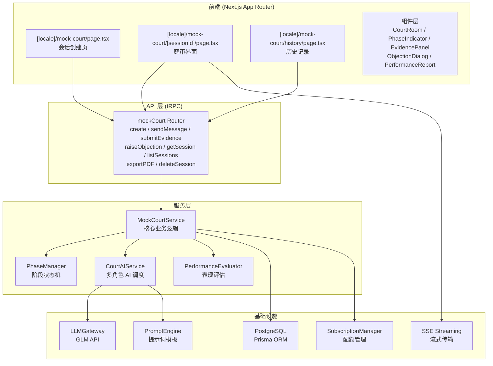
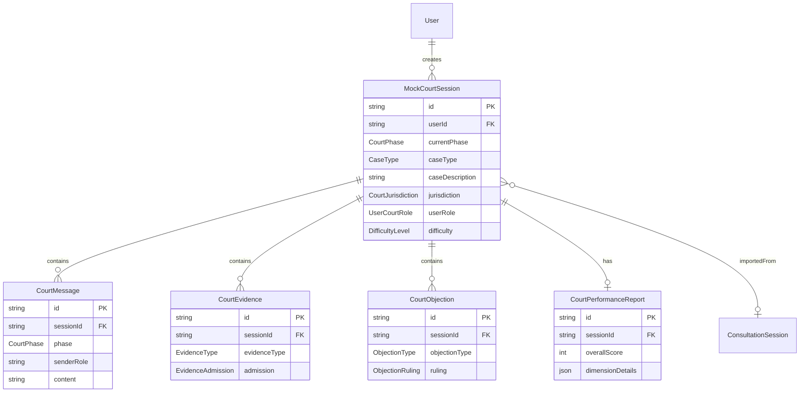
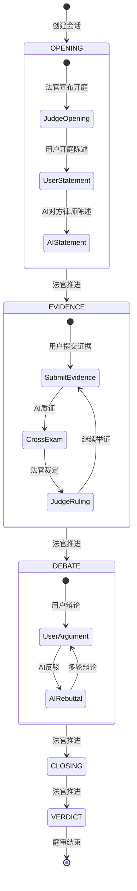

# 设计文档：模拟法庭（Mock Court Simulation）

## 概述

模拟法庭功能为 WINAI 平台新增一个交互式 AI 庭审模拟模块。用户可以在 AI 驱动的虚拟法庭中，与 AI 法官、对方律师进行多轮对抗式庭审练习。系统基于现有的 LLM Gateway（GLM）、PromptEngine、tRPC 路由层和 Prisma ORM 构建，复用平台已有的 SSE 流式传输、会话管理、订阅配额等基础设施。

核心设计目标：
- 以状态机驱动庭审阶段流转（OPENING → EVIDENCE → DEBATE → CLOSING → VERDICT）
- 多角色 AI 对话：法官、对方律师、证人各自拥有独立的系统提示词和行为逻辑
- 流式响应：AI 角色发言通过 SSE 流式传输，提供实时交互体验
- 与平台已有案件分析、证据管理服务集成，支持案情导入
- 基于订阅等级的访问控制和使用配额管理

## 架构

### 整体架构图



### 技术选型决策

| 决策项 | 选择 | 理由 |
|--------|------|------|
| API 层 | tRPC mutation/query | 与平台现有模式一致，类型安全 |
| AI 流式传输 | SSE (Server-Sent Events) | 复用现有 `useSSEStream` hook 和 `/api/` 路由模式 |
| 状态管理 | 服务端状态机 + DB 持久化 | 庭审阶段流转需要可靠的服务端状态，支持断线恢复 |
| 多角色 AI | 独立系统提示词 + 角色标注 | 每个 AI 角色使用不同的 PromptTemplate，响应中携带角色标识 |
| PDF 导出 | 复用现有 `exportPDF` 服务模式 | 平台已有 PDF 导出能力 |
| 提示词管理 | PromptEngine + DB PromptTemplate | 支持运行时更新提示词，无需重新部署 |

## 组件与接口

### 1. tRPC Router: `mockCourtRouter`

```typescript
// src/server/routers/mockCourt.ts
export const mockCourtRouter = createTRPCRouter({
  // 创建模拟法庭会话
  create: protectedProcedure
    .input(CreateSessionInput)  // Case_Config + User_Role + Difficulty_Level
    .mutation(async ({ ctx, input }) => MockCourtSession),

  // 从案件分析导入案情
  importFromCaseAnalysis: protectedProcedure
    .input(z.object({ caseAnalysisSessionId: z.string() }))
    .query(async ({ ctx, input }) => CaseConfigPartial),

  // 获取用户历史案件分析列表
  listCaseAnalyses: protectedProcedure
    .query(async ({ ctx }) => CaseAnalysisSummary[]),

  // 发送庭审消息（用户发言）
  sendMessage: protectedProcedure
    .input(z.object({ sessionId: z.string(), content: z.string() }))
    .mutation(async ({ ctx, input }) => CourtMessageResponse),

  // 提交证据
  submitEvidence: protectedProcedure
    .input(SubmitEvidenceInput)
    .mutation(async ({ ctx, input }) => EvidenceSubmissionResult),

  // 提出异议
  raiseObjection: protectedProcedure
    .input(RaiseObjectionInput)
    .mutation(async ({ ctx, input }) => ObjectionRulingResult),

  // 回应 AI 异议
  respondToObjection: protectedProcedure
    .input(z.object({ sessionId: z.string(), response: z.string() }))
    .mutation(async ({ ctx, input }) => ObjectionResolutionResult),

  // 获取会话详情（含消息历史）
  getSession: protectedProcedure
    .input(z.object({ sessionId: z.string() }))
    .query(async ({ ctx, input }) => MockCourtSessionDetail),

  // 列出用户的模拟法庭会话
  listSessions: protectedProcedure
    .query(async ({ ctx }) => MockCourtSessionSummary[]),

  // 获取表现评估报告
  getReport: protectedProcedure
    .input(z.object({ sessionId: z.string() }))
    .query(async ({ ctx, input }) => PerformanceReport),

  // 导出 PDF
  exportPDF: protectedProcedure
    .input(z.object({ sessionId: z.string() }))
    .mutation(async ({ ctx, input }) => { pdf: string }),

  // 软删除会话
  deleteSession: protectedProcedure
    .input(z.object({ sessionId: z.string() }))
    .mutation(async ({ ctx, input }) => { success: boolean }),
});
```

### 2. SSE 流式端点

```typescript
// src/app/api/mock-court/stream/route.ts
// POST: 接收用户消息，流式返回 AI 角色响应
// 响应格式: { role: AI_Role, content: string, phase: Court_Phase, done: boolean }
export async function POST(req: NextRequest): Promise<Response>
```

### 3. MockCourtService（核心服务）

```typescript
// src/server/services/mock-court/service.ts
export class MockCourtService {
  // 创建会话：校验配额 → 创建 DB 记录 → 生成初始法官开场白
  async createSession(userId: string, config: CreateSessionInput): Promise<MockCourtSession>

  // 处理用户消息：保存消息 → 调度 AI 响应 → 检查阶段转换
  async processMessage(sessionId: string, userId: string, content: string): Promise<CourtMessageResponse>

  // 提交证据：保存证据 → AI 对方律师质证 → AI 法官裁定
  async submitEvidence(sessionId: string, userId: string, evidence: EvidenceInput): Promise<EvidenceSubmissionResult>

  // 处理异议：用户异议 → AI 法官裁定 / AI 异议 → 等待用户回应
  async handleObjection(sessionId: string, userId: string, objection: ObjectionInput): Promise<ObjectionRulingResult>

  // 恢复会话
  async resumeSession(sessionId: string, userId: string): Promise<MockCourtSessionDetail>

  // 生成表现报告
  async generateReport(sessionId: string): Promise<PerformanceReport>
}
```

### 4. PhaseManager（阶段状态机）

```typescript
// src/server/services/mock-court/phase-manager.ts
export class PhaseManager {
  // 合法的阶段转换
  private static TRANSITIONS: Record<CourtPhase, CourtPhase | null> = {
    OPENING: 'EVIDENCE',
    EVIDENCE: 'DEBATE',
    DEBATE: 'CLOSING',
    CLOSING: 'VERDICT',
    VERDICT: null,  // 终态
  }

  // 判断是否可以转换到下一阶段
  canTransition(currentPhase: CourtPhase): boolean

  // 执行阶段转换，返回新阶段
  transition(currentPhase: CourtPhase): CourtPhase

  // 获取当前阶段的规则描述（用于 AI 提示词）
  getPhaseRules(phase: CourtPhase, jurisdiction: Jurisdiction): string
}
```

### 5. CourtAIService（多角色 AI 调度）

```typescript
// src/server/services/mock-court/court-ai.ts
export class CourtAIService {
  // 生成法官发言（阶段引导、裁定、判决等）
  async generateJudgeResponse(context: CourtContext): Promise<AIResponse>

  // 生成对方律师发言（反驳、质证、异议等）
  async generateOpposingCounselResponse(context: CourtContext): Promise<AIResponse>

  // 生成证人发言
  async generateWitnessResponse(context: CourtContext): Promise<AIResponse>

  // 流式生成 AI 响应（用于 SSE 端点）
  async *streamResponse(role: AIRole, context: CourtContext): AsyncIterable<LLMStreamChunk>

  // 构建角色系统提示词
  private buildSystemPrompt(role: AIRole, config: CaseConfig, phase: CourtPhase): Promise<string>
}
```

### 6. PerformanceEvaluator（表现评估）

```typescript
// src/server/services/mock-court/evaluator.ts
export class PerformanceEvaluator {
  // 基于完整庭审记录生成评估报告
  async evaluate(session: MockCourtSessionDetail): Promise<PerformanceReport>

  // 评估单个维度
  private async evaluateDimension(
    dimension: ScoreDimension,
    messages: CourtMessage[],
    config: CaseConfig
  ): Promise<DimensionScore>
}
```

### 7. 前端组件

| 组件 | 路径 | 职责 |
|------|------|------|
| `CreateSessionForm` | `components/mock-court/CreateSessionForm.tsx` | 会话创建表单，含案件配置和案情导入 |
| `CourtRoom` | `components/mock-court/CourtRoom.tsx` | 庭审主界面，消息列表 + 输入区 |
| `PhaseIndicator` | `components/mock-court/PhaseIndicator.tsx` | 顶部阶段进度条 |
| `EvidencePanel` | `components/mock-court/EvidencePanel.tsx` | 证据清单侧边栏 |
| `ObjectionDialog` | `components/mock-court/ObjectionDialog.tsx` | 异议提出/回应对话框 |
| `PerformanceReport` | `components/mock-court/PerformanceReport.tsx` | 评估报告展示页 |
| `CourtMessage` | `components/mock-court/CourtMessage.tsx` | 单条庭审消息（含角色标注） |
| `SessionHistory` | `components/mock-court/SessionHistory.tsx` | 历史会话列表 |


## 数据模型

### 新增 Prisma 模型

```prisma
// ==================== 模拟法庭 ====================

enum CourtPhase {
  OPENING
  EVIDENCE
  DEBATE
  CLOSING
  VERDICT
}

enum MockCourtStatus {
  ACTIVE
  COMPLETED
  DELETED
}

enum UserCourtRole {
  PLAINTIFF_LAWYER
  DEFENDANT_LAWYER
}

enum AICourtRole {
  JUDGE
  OPPOSING_COUNSEL
  WITNESS
}

enum CaseType {
  CONTRACT_DISPUTE
  TORT
  LABOR_DISPUTE
  IP_DISPUTE
  CROSS_BORDER_TRADE
  OTHER
}

enum CourtJurisdiction {
  CHINA
  THAILAND
  ARBITRATION
}

enum DifficultyLevel {
  BEGINNER
  INTERMEDIATE
  ADVANCED
}

enum EvidenceType {
  DOCUMENTARY    // 书证
  PHYSICAL       // 物证
  TESTIMONY      // 证人证言
  EXPERT_OPINION // 鉴定意见
  ELECTRONIC     // 电子数据
}

enum EvidenceAdmission {
  PENDING
  ADMITTED
  PARTIALLY_ADMITTED
  REJECTED
}

enum ObjectionType {
  IRRELEVANT
  HEARSAY
  LEADING_QUESTION
  NON_RESPONSIVE
  OTHER
}

enum ObjectionRuling {
  SUSTAINED   // 异议成立
  OVERRULED   // 异议驳回
  PENDING     // 待裁定
}

model MockCourtSession {
  id              String            @id @default(cuid())
  userId          String
  status          MockCourtStatus   @default(ACTIVE)
  currentPhase    CourtPhase        @default(OPENING)

  // Case Config
  caseType        CaseType
  caseDescription String            @db.Text
  jurisdiction    CourtJurisdiction
  userRole        UserCourtRole
  difficulty      DifficultyLevel
  supplementary   Json?             // 案件类型补充字段（合同金额、争议焦点等）

  // 来源
  importedFromSessionId String?     // 从案件分析导入时的源会话 ID

  // 评估报告
  reportGenerated Boolean           @default(false)

  createdAt       DateTime          @default(now())
  updatedAt       DateTime          @updatedAt
  deletedAt       DateTime?         // 软删除

  messages        CourtMessage[]
  evidenceItems   CourtEvidence[]
  objections      CourtObjection[]
  report          CourtPerformanceReport?

  @@index([userId, status])
  @@index([userId, createdAt])
}

model CourtMessage {
  id          String        @id @default(cuid())
  sessionId   String
  phase       CourtPhase
  senderRole  String        // 'USER' | 'JUDGE' | 'OPPOSING_COUNSEL' | 'WITNESS' | 'SYSTEM'
  content     String        @db.Text
  metadata    Json?         // 附加信息（如阶段转换标记、异议关联等）
  createdAt   DateTime      @default(now())

  session     MockCourtSession @relation(fields: [sessionId], references: [id])

  @@index([sessionId, createdAt])
}

model CourtEvidence {
  id              String            @id @default(cuid())
  sessionId       String
  name            String
  evidenceType    EvidenceType
  description     String            @db.Text
  proofPurpose    String            @db.Text    // 证明目的
  submittedBy     String            // 'USER' | 'OPPOSING_COUNSEL'
  admission       EvidenceAdmission @default(PENDING)
  admissionReason String?           @db.Text
  createdAt       DateTime          @default(now())

  session         MockCourtSession  @relation(fields: [sessionId], references: [id])

  @@index([sessionId])
}

model CourtObjection {
  id              String          @id @default(cuid())
  sessionId       String
  objectionType   ObjectionType
  raisedBy        String          // 'USER' | 'OPPOSING_COUNSEL'
  reason          String?         @db.Text
  ruling          ObjectionRuling @default(PENDING)
  rulingReason    String?         @db.Text
  relatedMessageId String?        // 关联的消息 ID
  createdAt       DateTime        @default(now())

  session         MockCourtSession @relation(fields: [sessionId], references: [id])

  @@index([sessionId])
}

model CourtPerformanceReport {
  id                  String   @id @default(cuid())
  sessionId           String   @unique
  legalArgumentScore  Int      // 法律论证质量 1-10
  evidenceUseScore    Int      // 证据运用能力 1-10
  procedureScore      Int      // 程序规范性 1-10
  adaptabilityScore   Int      // 应变能力 1-10
  expressionScore     Int      // 语言表达 1-10
  overallScore        Float    // 加权平均总分
  overallComment      String   @db.Text
  dimensionDetails    Json     // 各维度详细评价 { dimension: { comment, strengths, weaknesses } }
  improvements        Json     // 改进建议 [{ suggestion, exampleQuote }]
  legalCitations      Json     // 用户引用的法条及准确性 [{ citation, isAccurate, correction? }]
  verdictSummary      String   @db.Text  // 判决摘要
  createdAt           DateTime @default(now())

  session             MockCourtSession @relation(fields: [sessionId], references: [id])
}
```

### 数据关系图



### 庭审阶段状态机




## 正确性属性（Correctness Properties）

*正确性属性是指在系统所有合法执行路径中都应成立的特征或行为——本质上是对系统应做什么的形式化陈述。属性是连接人类可读规格说明与机器可验证正确性保证之间的桥梁。*

### Property 1: 案件配置表单验证

*For any* 案件配置输入，当案情描述长度小于 50 或大于 5000 个字符时，或任何必填字段为空时，验证函数应拒绝该输入并返回对应的错误信息；当所有必填字段已填写且案情描述长度在 50-5000 之间时，验证函数应接受该输入。

**Validates: Requirements 1.2, 1.6**

### Property 2: 案件类型补充字段映射

*For any* 案件类型（CaseType），获取该类型对应的补充配置字段列表应返回非空的字段定义数组，且不同案件类型返回的字段集合应与预定义的映射一致。

**Validates: Requirements 1.3**

### Property 3: 庭审阶段顺序不变性

*For any* 模拟法庭会话，阶段转换必须严格遵循 OPENING → EVIDENCE → DEBATE → CLOSING → VERDICT 的顺序。对于任意当前阶段，`PhaseManager.transition()` 应返回且仅返回下一个合法阶段；对于 VERDICT 阶段，不应允许任何转换。

**Validates: Requirements 3.1**

### Property 4: 阶段转换生成法官引导消息

*For any* 阶段转换事件，系统应生成一条 senderRole 为 'JUDGE' 的 CourtMessage，其 phase 字段等于新进入的阶段。

**Validates: Requirements 3.2**

### Property 5: 阶段限定操作可用性

*For any* 庭审会话和当前阶段，证据提交操作仅在 EVIDENCE 阶段可用；异议操作在除 VERDICT 外的所有阶段可用；用户发言在除 VERDICT 外的所有阶段可用。

**Validates: Requirements 3.4, 3.5, 6.1**

### Property 6: 管辖区特定提示词内容

*For any* 管辖区（Jurisdiction）和 AI 角色（JUDGE / OPPOSING_COUNSEL），构建的系统提示词应包含该管辖区对应的法律体系引用：CHINA 包含中国法律条文引用，THAILAND 包含泰国法律条文引用，ARBITRATION 包含仲裁规则引用。

**Validates: Requirements 4.5, 4.6, 4.7, 9.2**

### Property 7: 难度等级对抗策略映射

*For any* 难度等级（DifficultyLevel），对方律师的系统提示词应包含该等级对应的对抗策略指令：BEGINNER 包含基础事实反驳指令，INTERMEDIATE 包含法条引用指令，ADVANCED 包含判例和复杂法律推理指令。

**Validates: Requirements 4.2, 9.4**

### Property 8: AI 消息角色标注完整性

*For any* AI 生成的 CourtMessage，senderRole 字段必须为 'JUDGE'、'OPPOSING_COUNSEL' 或 'WITNESS' 之一，且不得为空。

**Validates: Requirements 4.8**

### Property 9: 异议裁定流程完整性

*For any* 提出的异议（无论由用户还是 AI 对方律师提出），系统应生成一条 AI 法官裁定消息，裁定结果为 SUSTAINED 或 OVERRULED，且包含裁定理由。

**Validates: Requirements 4.4, 6.3**

### Property 10: AI 异议暂停状态

*For any* AI 对方律师提出的异议，会话应进入等待用户回应的状态，在用户回应之前不应处理新的普通庭审消息。

**Validates: Requirements 6.5**

### Property 11: 证据提交验证与工作流

*For any* 证据提交，系统应要求证据名称、证据类型、证据描述和证明目的四个字段均非空；提交成功后，应依次生成 AI 对方律师质证消息和 AI 法官采纳裁定消息。

**Validates: Requirements 5.2, 5.3, 5.4**

### Property 12: 案件分析导入数据映射

*For any* 包含案情描述、案件类型和管辖区的案件分析会话，导入操作应正确映射这三个字段到 Mock_Court_Session 的 Case_Config 中，且映射后的值与源数据一致。

**Validates: Requirements 2.3**

### Property 13: 案件分析导入证据预填充

*For any* 包含证据信息的案件分析会话，导入操作应将证据数据预填充到会话的证据清单中。

**Validates: Requirements 5.6**

### Property 14: 会话列表时间排序

*For any* 用户的模拟法庭会话集合，列表查询返回的结果应按创建时间（或完成时间）倒序排列。

**Validates: Requirements 2.2, 8.4**

### Property 15: AI 提示词结构合规性

*For any* AI 角色（JUDGE / OPPOSING_COUNSEL / WITNESS），其系统提示词应包含：角色定义、中泰跨境法律专业资质说明、输出格式规则、法律免责声明指令、`{{caseConfig}}` 占位符和 `{{currentPhase}}` 占位符。

**Validates: Requirements 9.1, 9.3, 9.5, 9.6, 9.7, 9.8**

### Property 16: AI 语言适配

*For any* 用户语言设置（zh / en / th），AI 角色的系统提示词应包含指示模型以该语言回复的指令。

**Validates: Requirements 10.4**

### Property 17: 表现报告完整性与评分范围

*For any* 生成的 PerformanceReport，应包含五个评分维度（法律论证质量、证据运用能力、程序规范性、应变能力、语言表达），每个维度评分在 1-10 之间，每个维度包含详细文字评价，报告包含改进建议和法律条文引用列表，且总体评分等于各维度的加权平均值。

**Validates: Requirements 7.2, 7.3, 7.4, 7.5, 7.6**

### Property 18: 会话数据持久化往返

*For any* MockCourtSession 及其关联的消息和证据，保存到数据库后再查询，应返回与原始数据等价的结果（包括当前阶段、所有消息内容和顺序、证据清单及状态）。

**Validates: Requirements 8.1, 11.1, 11.2**

### Property 19: 软删除行为

*For any* 被删除的 MockCourtSession，deletedAt 字段应被设置为当前时间，且该会话不应出现在正常的会话列表查询结果中，但数据库中仍保留该记录。

**Validates: Requirements 11.5**

### Property 20: 订阅等级访问控制

*For any* 订阅等级（SubscriptionTier）和用户当月已创建的会话数量，系统应正确执行以下规则：FREE 用户每月最多 2 次且仅允许 BEGINNER 难度；STANDARD 用户每月最多 10 次且允许 BEGINNER/INTERMEDIATE 难度；VIP 用户无次数限制且允许所有难度。超出限制时应拒绝创建。

**Validates: Requirements 12.2, 12.3, 12.4, 12.5**

### Property 21: 使用记录计数

*For any* 成功创建的 MockCourtSession，用户的 UsageRecord 中当月计数应增加 1。

**Validates: Requirements 12.6**

### Property 22: 认证保护

*For any* 未认证的请求，模拟法庭的所有 tRPC 端点应返回 UNAUTHORIZED 错误。

**Validates: Requirements 12.1**

### Property 23: i18n 翻译键完整性

*For any* 模拟法庭定义的 i18n 翻译键，zh.json、en.json 和 th.json 三个语言文件中都应包含该键的翻译值。

**Validates: Requirements 10.1**

## 错误处理

### 错误分类与处理策略

| 错误类型 | 场景 | 处理方式 |
|----------|------|----------|
| 认证错误 | 未登录用户访问 | tRPC `enforceAuth` 中间件返回 `UNAUTHORIZED` |
| 配额超限 | 用户达到月度创建上限 | 返回 `FORBIDDEN`，附带升级提示信息 |
| 难度权限不足 | FREE 用户选择 INTERMEDIATE/ADVANCED | 返回 `FORBIDDEN`，附带订阅等级要求 |
| 表单验证失败 | 必填字段缺失或案情描述长度不合规 | Zod 验证返回 `BAD_REQUEST`，附带字段级错误 |
| 会话不存在 | 访问已删除或不存在的会话 | 返回 `NOT_FOUND` |
| 会话权限 | 用户访问他人的会话 | 返回 `FORBIDDEN` |
| 阶段操作非法 | 在非 EVIDENCE 阶段提交证据 | 返回 `BAD_REQUEST`，提示当前阶段不允许该操作 |
| 异议等待中 | 有未处理的 AI 异议时发送普通消息 | 返回 `BAD_REQUEST`，提示需先回应异议 |
| AI 服务不可用 | LLM Gateway 返回降级响应 | 返回友好提示，建议稍后重试；不中断会话状态 |
| AI 响应解析失败 | LLM 返回非预期格式 | 记录错误日志，返回通用错误提示，保持会话状态不变 |
| 数据库错误 | Prisma 操作失败 | 记录错误日志，返回 `INTERNAL_SERVER_ERROR` |
| PDF 导出失败 | PDF 生成过程出错 | 返回错误提示，建议重试 |

### AI 降级策略

当 LLM Gateway 不可用时：
1. `LLMGateway.isAvailable()` 返回 `false` → 阻止创建新会话，提示 AI 服务暂不可用
2. 流式响应中断 → 前端 `useSSEStream` 的 `onError` 回调触发，显示重试按钮
3. AI 响应超时（30s） → 自动中断请求，提示用户重试

## 测试策略

### 属性测试（Property-Based Testing）

使用 `fast-check` 库（项目已安装）进行属性测试，每个属性测试至少运行 100 次迭代。

测试文件：`tests/properties/mock-court.test.ts`

每个测试用 tag 注释关联设计文档中的属性：
```typescript
// Feature: mock-court-simulation, Property 1: 案件配置表单验证
```

重点属性测试覆盖：
- Property 1: 表单验证（生成随机字符串测试长度边界和必填字段）
- Property 3: 阶段转换顺序（生成随机阶段序列验证状态机）
- Property 5: 阶段限定操作（生成随机阶段和操作组合验证可用性）
- Property 6/7: 提示词内容（生成随机管辖区/难度组合验证提示词）
- Property 15: 提示词结构（生成随机角色验证结构合规性）
- Property 17: 评分范围和加权平均（生成随机评分验证计算）
- Property 18: 数据持久化往返（生成随机会话数据验证存取一致性）
- Property 20: 订阅访问控制（生成随机订阅等级和使用量组合验证限制）

### 单元测试

测试文件：`tests/unit/mock-court.test.ts`

覆盖场景：
- 会话创建的默认值（Property 对应 1.4）
- 案件分析导入的字段映射（具体示例）
- 证据提交工作流的完整流程（具体示例）
- 异议裁定流程（具体示例）
- 软删除行为验证
- AI 服务降级时的错误处理
- PDF 导出内容完整性

### 集成测试

测试文件：`tests/integration/mock-court.test.ts`

覆盖场景：
- tRPC 端点的认证保护
- 完整庭审流程（创建 → 各阶段 → 判决 → 报告）
- 会话恢复（创建 → 中断 → 恢复 → 验证状态一致）
- 订阅配额限制的端到端验证

### 测试配置

```typescript
// vitest.config.ts 中已有配置，属性测试使用 fast-check
// 每个属性测试配置：
fc.assert(fc.property(...), { numRuns: 100 });
```
